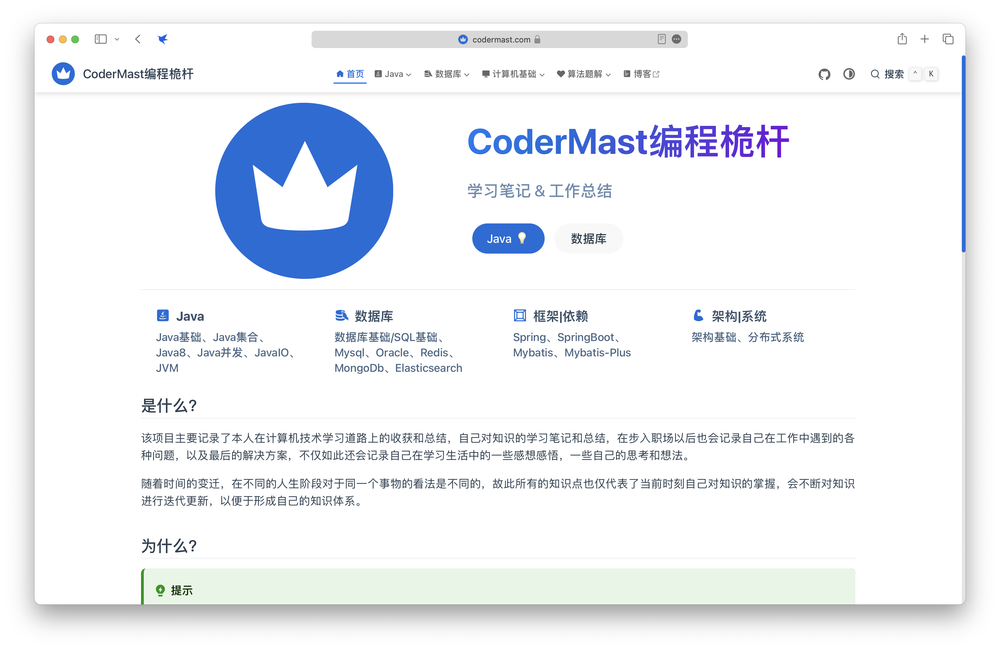

## 项目介绍

&emsp;&emsp;本项目是基于Vuepress框架 Vuepress-theme-hope主题搭建的一个个人学习笔记文档站点，项目内记录了本人学习过程中所总结的一些学习经验，其中包括Java、MySQL、Redis、Spring、SpringBoot、Kafka、Mybatis、Mybatis-plus、Docker、Linux、ElasticSearch、计算机网络、数据结构、操作系统、计算机组成原理等知识。

## 项目地址

<a href="https://www.codermast.com/?github">www.codermast.com</a>

## 项目内容
### Java
- Java基础
- Java集合
- JavaIO
- Java 8
- JVM
### MySQL

## Star趋势
> 虽然项目的 Star 可能非常非常少，但也足以鼓励我继续坚持下去！

