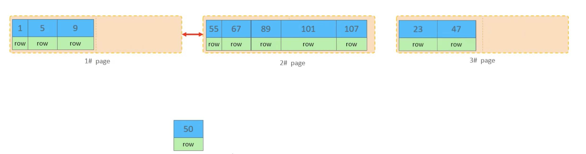

# SQL优化

## insert优化
### 批量插入
```sql
insert into table_name values (values_list...);
```
一次性可以插入多个数据，来减少多次请求带来的性能消耗，但是一次性插入的数据量不建议超过500-1000条。

### 手动提交事务
```sql
start transaction;
insert into table_name values (values_list1...);
insert into table_name values (values_list2...);
insert into table_name values (values_list3...);
commit;
```
在多次数据插入时，可以手动开启事务，将数据分组提交。
### 主键顺序插入
```
主键乱序：8 5 3 6 9 4 2 1 7 10
主键有序：1 2 3 4 5 6 7 8 9 10
```
::: info 提示
主键有序插入比主键乱序插入的速度要快，这是由于MySQL底层的数据结构造成的，我们在下一章节的主键优化里详细说明。
:::
### 大批量数据插入

如果一次性需要插入大量的数据，使用insert语句插入的性能不高，此时可以使用MySQL提供的load指令进行插入。

load指令可以将文件内的数据，一次性加载进数据库内。

具体操作如下：
```sql
-- 客户端连接服务端时，加上参数 --local-infile
mysql --local-infile -u root -p
-- 设置全局参数为local_infile = 1，开启从本地加载文件导入数据库的开关
set global local_infile = 1;
-- 执行load指令，将准备好的数据加载到数据表内
load data local infile 'file_path' into table `table_name` fields terminated by 'split_char' lines terminated by 'line_break';
```

::: note 参数说明
- file_path : 存储数据文件的路径地址
- table_name : 要插入数据的数据表名称
- split_char : 行内数据字段分隔符号
- line_break : 换行分隔符，即以什么标准判断数据行之间的分隔。
:::
## primery key优化

### 数据的组织方式

在InnoDB存储引擎中，表数据都是根据主键顺序组织存放的，这种存储方式的表称为索引组织表（index organized table IOT）。

而InnoDB存储引擎中，默认的聚集索引就是主键索引。


::: info 参数说明
- TableSpace：表空间，内存储的是segment段
- Segment：段，其存储的是extent区
- Extent：区，其存储的是page页【固定1M】
- Page：页，其内存储的是row行【固定16k】
- Row：行，其内存储的是数据行
这里的Extent和Page的空间大小是固定的，每个Extent区占据1M，每个Page页占据16K，则一个extent内包含了64个page
:::

### 页分裂
页可以为空，也可以填充一半，也可以填充100%。每个页包含了 2 - N 行数据，如果一行的数据过大，会行溢出，根据主键排序。

我们分别从 主键顺序插入 和 主键乱序插入 这两个角度来探究这个问题：

- 主键顺序插入
主键顺序插入数据，由于数据在页内存储会根据主键排序，那么此时所有的数据在页内都会顺序排列，页内剩余空间不足时，则开启下一个页，尽可能的保证了空间的利用率。也不存在数据的移动问题。

- 主键乱序插入
同理，数据按主键排序，那么在主键乱序插入一组数据以后，此时页内的数据是有序的，但是如果下一次想要插入的数据主键不为最大值，那么此时需要将数据插入到页中，而不是直接添加到页尾，则此时需要进行数据的移动。


1. 先开启一个新的数据页，page3

2. 将page1中50%的位置，将后半段数据移动到page3

3. 将主键为50的这行数据，插入到page3的末尾。

4. 由于要保证page之间有序，还需要调整页间指针的方向，调整为 page1 -> page3 -> page2

5. 此时则完成了数据的插入。

::: tip 小知识
我们将这种页面分裂的现象，叫做页分裂。那么在插入时会伴随页分裂，则相同的在数据删除时，就会出现页合并。
:::

### 页合并

当删除一行记录时，实际上并没有将记录值物理删除，只是记录被标记（flaged）为删除并且他的空间变得允许被其他记录值重新声明。当页中删除的记录达到MERGE_THRESHOLD(默认为页的50%)，innoDB会开始寻找最靠近的页（前或后）看看是否可以将两个页合并以优化空间使用。

::: info 小贴士
MERGE_THRESHOLD：合并页的阀值，可以自己设置，在创建表或者创建索引时指定。
:::

### 主键设计原则
- 满足业务需求的情况下，尽量降低主键的长度。
- 插入数据时，尽量使用顺序插入，选择使用AUTO_INCREMENT自增主键。
- 尽量不要使用UUID做主键或者是其他自然主键，如身份证号。
- 业务操作时避免对主键的修改。
## order by优化

## group by优化

## limit优化

## count优化

## update优化
