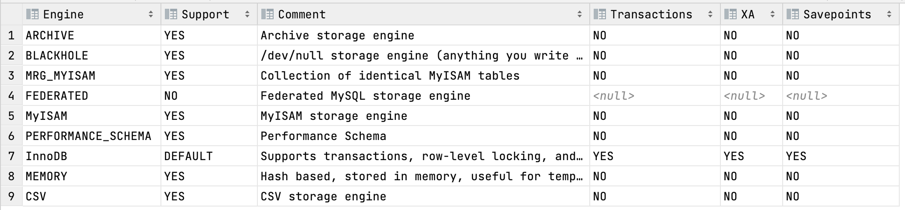

# MySQL进阶 - 存储引擎
## MySQL的体系结构


- 连接层
连接层处于MySQL体系结构中的最上层，是一些客户端和链接服务，主要完成一些类似于连接处理、授权认证、以及相关的安全方案。服务器也会为安全接入的每个客户端验证它所具有的操作权限。

- 服务层
服务层处于MySQL体系结构中的第二层，主要完成大多书的核心服务功能，如SQL接口，并完成缓存的查询，SQL的分析和优化，部分内置函数的执行。所有存储引擎的功能也在这一层实现，如 过程、函数等。

- 引擎层

引擎层处于MySQL体系结构中的第三层，真正的负责了MySQL中数据的存储和提取，服务器通过API和存储引擎进行通信。不同的存储引擎具有不同的功能，这样我们可以根据自己的需要，来选取合适的存储引擎。

- 存储层
存储层位于MySQL结构体系的最底层，主要是将数据存储在文件系统之上，完成与存储引擎的交互。

## 存储引擎简介

存储引擎就是存储数据、建立索引、更新/查询数据等技术的实现方式，存储引擎是基于表的，而不是基于库的，所以存储引擎也可以被称为表的类型。

也就是说，同一个数据库的不同表可以选择不同的存储引擎。

- 查看支持的存储引擎

```sql
SHOW ENGINES;
```


- 创建一张表并且指定引擎
```sql
create table users(
    id int primary key auto_increment,
    username varchar(10)
)engine=InnoDB
```
> 该SQL代表的意思是：创建一张名为users的表，其中有id和username两个字段，并且设置存储引擎为InnoDB

## 存储引擎特点

### InnoDB
1. 介绍
InnoDB是一种兼顾高可靠性和高性能的通用存储引擎，在MySQL5.5以后，InnoDB是默认的MySQL存储引擎。

2. 特点
- DML操作遵循ACID模型，支持事务
- 行级锁，提高并发访问性能
- 支持外键FOREIGN KEY约束，保证数据的完整性和正确性

3. 文件
`xxx.ibd`：xxx代表的是数据表名，InnoDB引擎的每张表都会对应这样一个表空间文件，存储该表的表架构(frm、sdi)、数据和索引。

参数：`innodb_file_per_table`
```sql
show variables like 'innodb_file_per_table';
```
4. 优点：提供良好的事务管理、崩溃修复能力和并发控制。

5. 缺点：读写效率稍差，空间占用比较大。

### MyISAM
1. 介绍
MyISAM是MySQL早期的默认存储引擎。

2. 特点
- 不支持事务，不支持外键
- 支持表锁，但不支持行锁
- 访问速度快

3. 文件
- xxx.sdi：存储表结构信息
- xxx.MYD：存储数据
- xxx.MYI：存储索引

### Memory
1. 介绍
Memory存储引擎的表数据存储在内存中，由于受到硬件问题、断电问题的影响，只能将这些表作为临时表或者缓存使用。
2. 特点
- 存放在内存中，访问速度快
- 支持Hash索引(<Badge text="默认" type="danger" />)
3. 文件
xxx.sdi：存储表结构信息，只有这一个，索引和数据均存储在内存中。

|特点|InnoDB|MyISAM|Memory|
|:---:|:---:|:---:|:---:|
|存储限制|64TB|有|有|
|事务安全|支持|-|-|
|锁机制|行锁|表锁|表锁|
|B+tree索引|支持|支持|支持|
|Hash索引|-|-|支持|
|全文索引|支持<Badge text="(5.6版本以后)" type="danger" />|支持|-|
|空间使用|高|低|N/A|
|内存使用|高|低|中等|
|批量插入速度|低|高|高|
|支持外键|支持|-|-|

## 存储引擎选择
在选择存储引擎时，应该根据应用系统的特点选择合适的存储引擎。对于复杂的应用系统，还可以根据实际情况选择多种存储引擎进行组合。

- InnoDB : 是Mysql的默认存储引擎，支持事务、外键。如果应用对事务的完整性有比较高的要求，在并发条件下要求数据的一致性，数据操作除了插入和查询之外，还包含很多的更新、删除操作，那么InnoDB存储引擎是比较合适的选择。

- MyISAM ： 如果应用是以读操作和插入操作为主，只有很少的更新和删除操作，并且对事务的完整性、并发性要求不是很高，那么选择这个存储引擎是非常合适的。

- Memory：将所有数据保存在内存中，访问速度快，通常用于临时表及缓存。MEMORY的缺陷就是对表的大小有限制，太大的表无法缓存在内存中，而且无法保障数据的安全性。但更多时候选择Redis数据库。