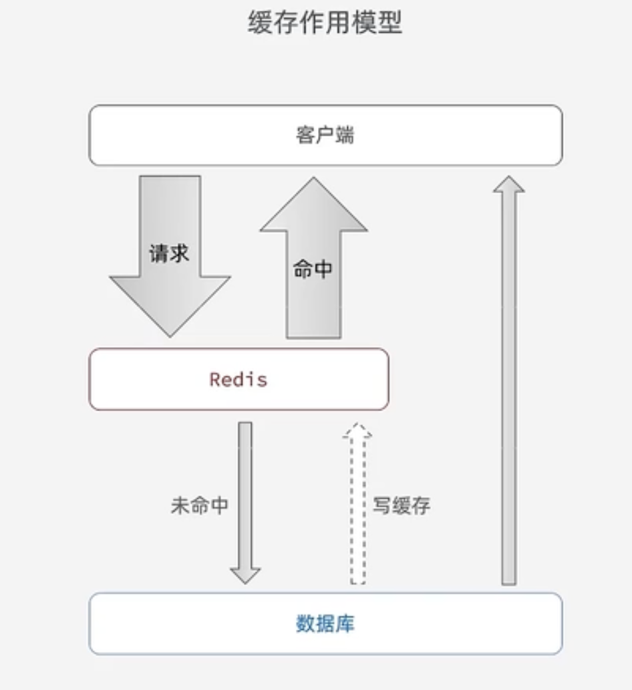
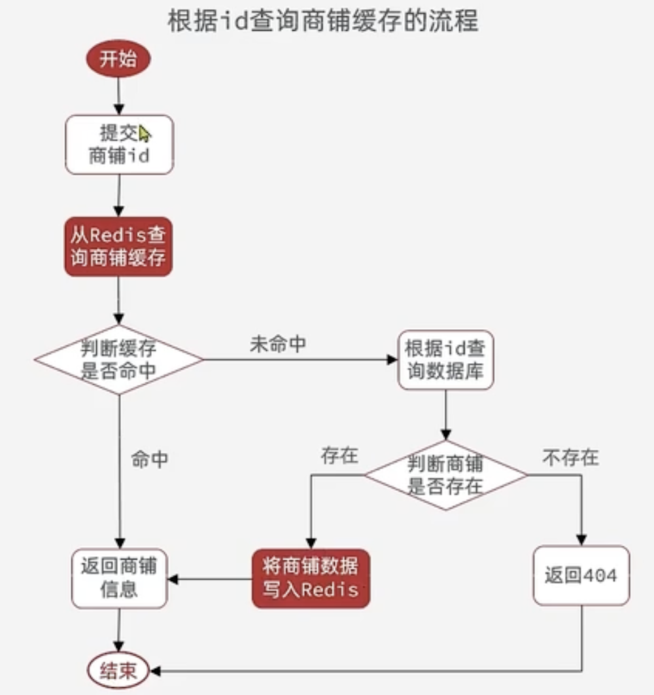

# Redis实战 - 商户查询缓存

::: tip 缓存

缓存就是数据交换的缓冲区（Cache），是存储数据的临时地方，一般读写性能比较高。

- 例如
1. 内存是硬盘的缓存
2. cache 是内存的缓存


- 作用

1. 降低后端负载
2. 提高读写效率，降低响应时间

- 成本

1. 数据一致性成本
2. 代码维护成本
:::

## 缓存更新策略

||内存淘汰|超时剔除|主动更新|
|:---:|:---:|:---:|:---:|
|说明|不用自己维护，利用 Redis 的内存淘汰机制，当内存不足时自动淘汰部分数据。下次查询时更新缓存|给缓存数据添加TTL时间，到期后自动删除缓存。下次查询时更新缓存。|编写业务逻辑，在修改数据库的同时，更新缓存。|
|一致性|差|一般|好|
|维护成本|无|低|高|

**业务场景：**
- 低一致性需求：数据的变化频率低，使用内存淘汰机制。例如：店铺类型的查询缓存。
- 高一致性需求：数据经常发生改变，主动更新，并以超时剔除作为兜底方案。例如：店铺详情查询的缓存。


### 主动更新策略

1. **Cache Aside Pattern**：由缓存的调用者，在更新数据库的同时更新缓存。

2. Read/Write Through Pattern：缓存和数据库整合为一个服务，由服务来维护一致性。调用者调用该服务，无需关心缓存一致性问题。

3. Write Behind Caching Pattern：调用者只操作缓存，由其他线程异步的将缓存数据持久化到数据库，保证最终一致。

> 一般情况下都使用第一种方法，可控性更高。

在操作缓存时，数据库发生修改则直接删除对应的缓存，待查询时再创建缓存。

- 单体系统，将缓存和数据库操作放在同一个事务内。
- 分布式系统，使用TCC等分布式事务方案。

先操作数据库，在删除缓存。


## 缓存穿透

缓存穿透是指客户端请求的数据在缓存中和数据库中都不存在，这样缓存永远不会生效，这些请求都会打到数据库。如请求不存在的数据，则 Redis 缓存中不存在，数据库中也不存在，频繁请求，造成资源的浪费。

解决这种问题的方法有两种：
- 缓存空对象
    - 优点：实现简单，维护方便
    - 缺点：1. 额外的内存消耗。 2. 可能造成短期的不一致
- 布隆过滤
    - 优点：内存占用小，没有多余的key
    - 缺点：1. 实现复杂 2. 存在误判可能

## 实现API





### 缓存商铺信息
```java
public Result queryById(Long id) {
    ValueOperations<String, Object> valueOps = redisTemplate.opsForValue();
    // 1. 从 Redis 查询商铺缓存
    String shopJson = (String) valueOps.get(RedisConstants.CACHE_SHOP_KEY + id);

    // 2. 判断缓存是否命中
    // 2.1 缓存命中，则直接返回商铺信息
    if (StrUtil.isNotBlank(shopJson)) {
        //log.info("缓存命中，输出缓存......");
        Shop shop = JSONUtil.toBean(shopJson, Shop.class);
        return Result.ok(shop);
    }

    // 2.2 缓存未命中，则根据 id 查询数据库
    Shop shopById = getById(id);

    // 2.2.1 商户不存在则返回 404
    if (shopById == null) {
        return Result.fail("404");
    }

    // 2.2.2 商户存在则将商铺数据写入 Redis 中，并返回
    String shopByIdJson = JSONUtil.toJsonStr(shopById);

    valueOps.set(RedisConstants.CACHE_SHOP_KEY + id,shopByIdJson);
    //log.info("缓存未命中，输出数据库......");

    return Result.ok(shopById);
}
```

### 缓存商铺类型

```java
public Result queryTypeList() {
    ValueOperations<String, Object> valueOps = redisTemplate.opsForValue();

    // 1. 查询缓存是否存在
    String shopTypeList  = (String) valueOps.get(RedisConstants.CACHE_SHOP_KEY + "list");

    List<ShopType> list = JSONUtil.toList(shopTypeList, ShopType.class);

    // 1.1 不为空时，缓存命中，直接返回
    if (StrUtil.isNotBlank(shopTypeList)) {
        //log.info("缓存命中，输出缓存....");
        return Result.ok(list);
    }

    // 缓存未命中，则查询数据库
    list = query().orderByAsc("sort").list();

    // 判断数据库中是否存在
    if (list.isEmpty()) {
        return Result.fail("数据为空！");
    }

    // 存在，则添加缓存并返回
    String listJson = JSONUtil.toJsonStr(list);
    valueOps.set(RedisConstants.CACHE_SHOP_KEY + "list",listJson);
    //log.info("缓存未命中，输出数据库....");

    return Result.ok(list);
}
```


### 更新商铺信息

在更新商铺信息后，需要删除 Redis 中对应的缓存，再下一次访问时重新添加缓存。
```java
@Transactional
public Result update(Shop shop) {
    // 1. 判断数据是否存在
    Long id = shop.getId();
    if (id == null){
        return Result.fail("店铺ID不能为空！");
    }
    // 2. 更新数据库
    updateById(shop);
    // 3. 删除缓存
    redisTemplate.delete(RedisConstants.CACHE_SHOP_KEY + id);
    return Result.ok("更新成功！");
}
```

