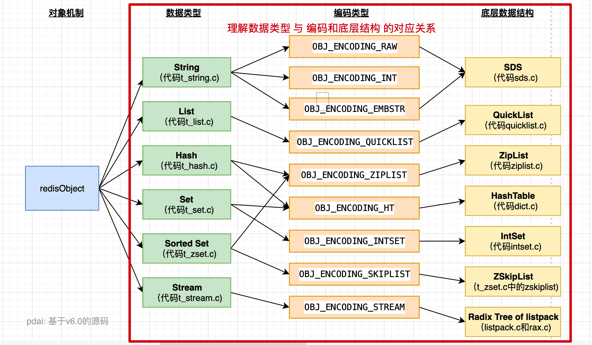

# Redis原理 - 五种数据类型的底层结构关系

## 字符串对象String

String 是 Redis 中最常见的数据存储类型。

- 其基本编码方式是 RAW ，基于简单动态字符串（SDS）实现，存储上限为 512 MB。

- 如果存储的 SDS 长度小于 44 字节，则会采用 **EMBSTR** 编码，此时 object head 与 SDS 是一段连续空间。申请内存时只需要调用一次内存分配函数，效率更高。

- 如果存储的字符串是整数型，并且大小在 LONG_MAX 范围内，则会采用INT 编码：直接将数据保存在 RedisObject 的 ptr 指针位置（刚好 8 字节），不再需要 SDS 了。

## 列表对象List

Redis 的 List 结构类似一个双端链表，可以从首、尾操作列表中的元素：

- 在 3.2 版本之前，Redis 采用 ZipList 和LinkedList 来实现 List，当元素数量小于512并且元素大小小于 64 字节时，采用 ZipList 编码，超过则采用 LinkedList 编码
- 在 3.2 版本之后，Redis 统一采用 QuickList 来实现List

## 哈希对象Hash

哈希对象的键是一个字符串类型，值是一个键值对集合。

哈希对象的编码可以是 ziplist 或者 hashtable；对应的底层实现有两种, 一种是ziplist, 一种是dict。

哈希结构与 Redis 中的 Zset 非常类似：

- 都是键值存储
- 都需求根据键获取值
- 键必须唯一

因此 Hash 底层采用的编码与 Zset 基本一致，只需要把排序有关的 SkipList 去掉即可：

- Hash 结构默认采用了 ZipList 编码，用以节省内存。ZipList 中相邻的两个 entry 分别保存 field 和 value

- 当数据量较大时 Hash 结构会转换为 HT 编码，也就是 Dict ，触发条件有两个：
    1. ZipList 中的元素数量超过了 hash-max-ziplist-entries（默认512）
    2. ZipList 中的任意 entry 大小超过了 hash-max-ziplist-value（默认64字节）
## 集合对象Set

Set 是 Redis 中的单列集合，满足下列特点：
- 不保证有序
- 保证元素唯一（可以判断元素是否存在）
- 求交集、并集、差集

Set 是 Redis 中的集合，不一定确保元素有序，可以满足元素唯一、查询效率要求极高。
- 为了查询效率和唯一性，set 采用 HT 编码（Dict）。Dict 中的 key 用来存储元素，value 统一为 null
- 当存储的所有数据都是整数，并且元素数量不超过`set-max-intset-entries`时，Set 会采用 IntSet 编码，以节省内存。每一次插入数据时都会判断数据是否为整数。
## 有序集合对象ZSet

ZSet 也就是 SortedSet ，其中每一个元素都需要指定一个score 值和 member 值。

- 可以根据score 值排序
- member 必须唯一
- 可以根据 member 查询分数

因此，ZSet 底层数据结构必须满足键值存储、键必须唯一、可排序这几个需求。

- SkipList：可以排序，并且可以同时存储 score 和 ele 值（member）。可以实现排序功能
- HT(Dict)：可以键值存储，并且可以根据 key 找 value。可以实现快速访问功能

为了同时实现排序和快速访问的功能，实际上的 ZSet 底层同时使用了两种结构，但由于编码方式只能写一种，这里写的是 OBJ_ENCODING_SKIPLIST

当元素数量不多时，HT 和 SkipList 的优势不明显，而且更耗费内存。因此 ZSet 还采用 ZipList 结构来节省内存，不过需要同时满足连个条件：

1. 元素数量小于 zset_max_ziplist_entries，默认值 128
2. 每个元素都小于 zset_max_ziplist_value字节，默认值 64

ZipList 本身没有排序功能，也没有键值对的概念，因此需要有 zset 通过编码实现：

- ZipList 是连续内存，因此 score 和 element 是紧挨在一起的两个 entry ，element在前，score 在后。
- score 越小越接近队首，score 越大越接近队尾，按照 score 值升序排列

