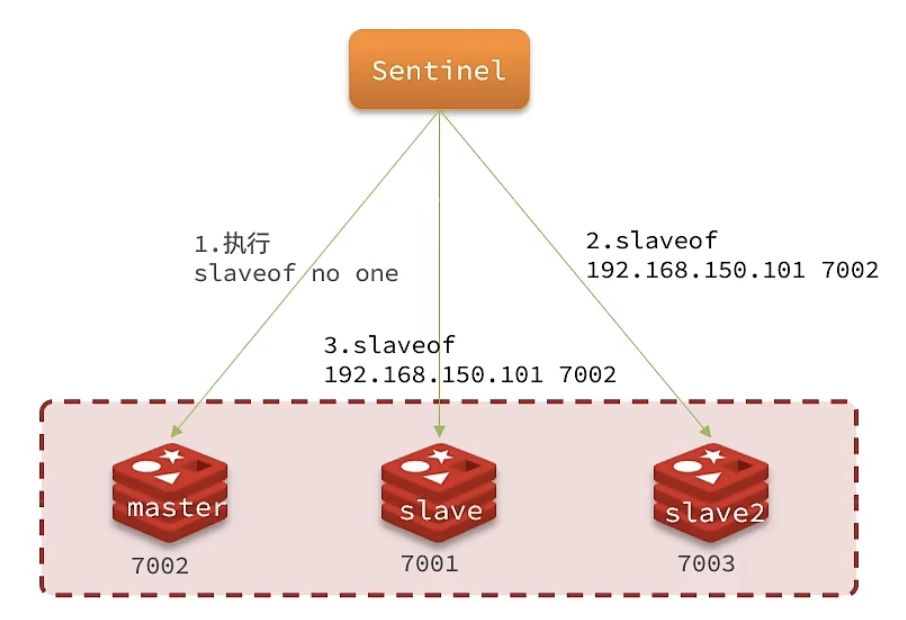

# Redis进阶 - Redis哨兵

::: warning 思考
slave 节点宕机恢复以后可以找 master 节点同步数据，那么 master 节点宕机怎么办？
:::

## 哨兵的作用和工作原理

### 哨兵的作用

Redis 提供了哨兵（Sentinel）机制来实现主从集群的自动故障恢复。哨兵的结构和作用如下：


- **监控**：Sentinel 会不断检查您的 master 和 slave 是否按照预期工作
- **自动故障恢复**：如果 master 故障，Sentinel 会将一个 slave 提升为 master 。当故障实例恢复后也以新的 master 为主
- **通知**：Sentinel 充当 Redis 客户端的服务发现来源，当集群发生故障转移时，会将最新信息推送给 Redis 的客户端

### 服务状态监控

Sentinel 基于心跳机制监测服务状态，每隔 1 秒向集群的每个实例发送 ping 命令：

- 主观下线：如果某 Sentinel 节点发现某实例未在规定时间响应，则认为该实例主观下线。

- 客观下线：若超过指定数量（quorum）的 sentinel 都认为该实例主观下线，则该实例客观下线。quorum 值最好超过 Sentinel 实例数量的一半。


### 选举新的master

一旦发现master 故障，sentinel 需要在 slave 中选择一个作为新的 master ，选择依据是这样：

- 首先会判断 slave 节点与 master 节点断开的时间长短，如果超过指定值（down-after-milliseconds * 10）则会排除该 slave 节点

- 然后判断 slave 节点的 slave-priority值，越小优先级越高，如果是 0 则永不参与选举

- 如果 slave-prority 一样，则判断 slave 节点的 offset 值，越大则说明数据越新，优先级越高

- 最后是判断 slave 节点的运行 id 大小，越小优先级越高


### 实现故障转移

当选中了其中一个 slave 为新的 master 后（例如slave1），故障转移的步骤如下：

1. sentinel 给备选的 slave1 节点发送 slaveof no one 命令，让该节点成为 master

2. sentinel 给所有其他 slave 发送 slaveof 192.168.150.101 7002 命令，让这些 slave 成为新 master 的从节点，开始从新的 master 上同步数据。

3. 最后 sentinel 将故障节点标记为 slave，当故障节点恢复后会自动成为新的 master 的 slave 节点



### 小结

**Sentinel 的三个作用是什么？**

- 监控
- 故障转移
- 通知

**Sentinel 如何判断一个 Redis 实例是否健康？**

- 每隔 1 秒发送一次 ping 命令，如果超过一定时间没有相向则认为是主观下线

- 如果大多数 sentinel 都认为实例主观下线，则判定服务下线

**故障转移步骤有哪些？**

- 首先选定一个 slave 作为新的 master，执行 slaveof no one
- 然后让所有节点都执行 slaveof 新master
- 修改故障节点配置，添加 slaveof 新master

## 搭建哨兵集群


### 集群结构
 
这里我们搭建一个三节点形成的Sentinel集群，来监管之前的Redis主从集群。如图：

三个sentinel实例信息如下：
 
| 节点 |       IP        | PORT  |
| :----: | :-------------: | :---: |
| s1   | 192.168.150.101 | 27001 |
| s2   | 192.168.150.101 | 27002 |
| s3   | 192.168.150.101 | 27003 |
 
### 准备实例和配置
 
要在同一台虚拟机开启3个实例，必须准备三份不同的配置文件和目录，配置文件所在目录也就是工作目录。
 
我们创建三个文件夹，名字分别叫s1、s2、s3：
 
```sh
# 进入/tmp目录
cd /tmp
# 创建目录
mkdir s1 s2 s3
```
 
然后我们在s1目录创建一个sentinel.conf文件，添加下面的内容：
 
```ini
port 27001
sentinel announce-ip 192.168.150.101
sentinel monitor mymaster 192.168.150.101 7001 2
sentinel down-after-milliseconds mymaster 5000
sentinel failover-timeout mymaster 60000
dir "/tmp/s1"
```
 
 
- `port 27001`：是当前sentinel实例的端口
- `sentinel monitor mymaster 192.168.150.101 7001 2`：指定主节点信息
  - `mymaster`：主节点名称，自定义，任意写
  - `192.168.150.101 7001`：主节点的ip和端口
  - `2`：选举master时的quorum值
 
 
 
然后将s1/sentinel.conf文件拷贝到s2、s3两个目录中（在/tmp目录执行下列命令）：
 
```sh
# 方式一：逐个拷贝
cp s1/sentinel.conf s2
cp s1/sentinel.conf s3
# 方式二：管道组合命令，一键拷贝
echo s2 s3 | xargs -t -n 1 cp s1/sentinel.conf
```
 
 
 
修改s2、s3两个文件夹内的配置文件，将端口分别修改为27002、27003：
 
```sh
sed -i -e 's/27001/27002/g' -e 's/s1/s2/g' s2/sentinel.conf
sed -i -e 's/27001/27003/g' -e 's/s1/s3/g' s3/sentinel.conf
```
 
 
 
### 启动
 
为了方便查看日志，我们打开3个ssh窗口，分别启动3个redis实例，启动命令：
 
```sh
# 第1个
redis-sentinel s1/sentinel.conf
# 第2个
redis-sentinel s2/sentinel.conf
# 第3个
redis-sentinel s3/sentinel.conf
```

启动后：
 

 
 
### 测试
 
尝试让master节点7001宕机，查看sentinel日志：
 


查看7003的日志：
 

 
查看7002的日志：
 


## RedisTemplate连接集群

在 Sentinel 集群监管下的 Redis 主从集群，其节点会因为自动故障转移而发生变化，Redis 的客户端必须感知这种变化，及时更新连接信息。Spring 的 RedisTemplate 底层利用 lettuce 实现了节点的感知和自动切换。


1. 引入 pom 文件

```xml
<dependency>
    <groupId>org.springframework.boot</groupId>
    <artifactId>spring-boot-starter-data-redis</artifactId>
</dependency>
```

2. 配置文件

```yaml
spring:
  redis:
    sentinel:
      master: mymaster
      nodes:
      - 192.168.127.101:27001
      - 192.168.127.101:27002
      - 192.168.127.101:27003
```

3. 修改配置类，实现读写分离

> 这个方法写在项目启动类中。

```java
// 常规写法
@Bean 
public LettuceClientConfigurationBuilderCustomizer lettuceClientConfigurationBuilderCustomizer(){
    return clientConfigurationBuilder -> clientConfigurationBuilder.readFrom(ReadFrom.REPLICA_PREFERRED);
}
// 匿名内部类的简写
@Bean
public LettuceClientConfigurationBuilderCustomizer lettuceClientConfigurationBuilderCustomizer(){
    @Override
    public void customize(LettuceClientConfiguration.LettuceClientConfigurationbuilder clientConfigurationBuilder){
        clientConfigurationBuilder.readFrom(ReadFrom.REPLICA_PREFERRED);
    }
}
```

4. 控制器 Controller 类

```java
@RestController
public class RedisController {

    @Autowired
    private StringRedisTemplate stringRedisTemplate;

    @GetMapping("/set/{key}/{value}")
    public String setKey(@PathVariable("key") String key, @PathVariable("value") String value){
        stringRedisTemplate.opsForValue().set(key, value);
        return "success";
    }

    @GetMapping("/get/{key}")
    public String getKey(@PathVariable("key")String key) {
        String value = stringRedisTemplate.opsForValue().get(key);
        return value;
    }
}
```

5. 测试访问

- 添加：http://localhost:8080/set/name/codermast/
- 查询：http://localhost:8080/get/name/