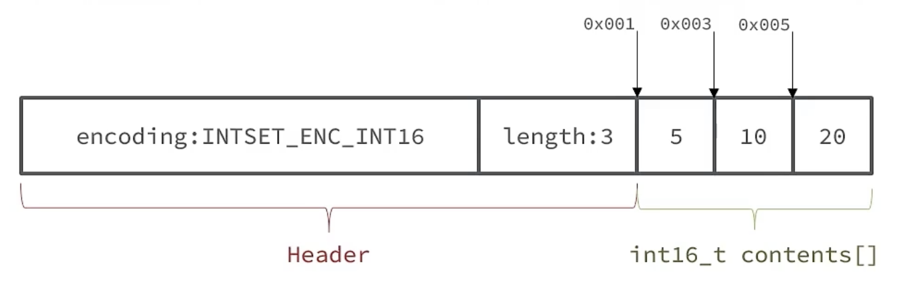

# Redis原理 - 数据结构的底层实现

## 动态字符串SDS

### 基本概念
Redis 中保存的 Key 是字符串，Value 往往是字符串或者字符串的集合。可见字符串是 Redis 中最常见的一种数据结构。

Redis 是使用 C 语言来编写的，C 语言中也有字符串，但是 Redis 中并没有直接使用 C 语言的字符串，这是因为 C 语言中字符串存在着很多的问题：
- 获取字符串长度需要进行运算
- 非二进制安全，不能包含特殊字符

> 因为C字符串以空字符作为字符串结束的标识，而对于一些二进制文件（如图片等），内容可能包括空字符串，因此C字符串无法正确存取；而所有 SDS 的API 都是以处理二进制的方式来处理 buf 里面的元素，并且 SDS 不是以空字符串来判断是否结束，而是以 len 属性表示的长度来判断字符串是否结束。

- 不可修改，C 语言的字符串实质为字符数组，以`\0`结尾。

为了解决以上问题，Redis 自己构建了一种新的字符串结构，称为简单动态字符串（Simple Dynamic String），简称为SDS

### 底层实现

SDS 在 Redis 中的实现在 `/src/sds.h`、`/src/sds.c` 文件中，具体的核心实现如下：

```c
/* Note: sdshdr5 is never used, we just access the flags byte directly.
 * However is here to document the layout of type 5 SDS strings. */
struct __attribute__ ((__packed__)) sdshdr5 {
    unsigned char flags; /* 3 lsb of type, and 5 msb of string length */
    char buf[];
};
struct __attribute__ ((__packed__)) sdshdr8 {
    uint8_t len; /* used */
    uint8_t alloc; /* excluding the header and null terminator */
    unsigned char flags; /* 3 lsb of type, 5 unused bits */
    char buf[];
};
struct __attribute__ ((__packed__)) sdshdr16 {
    uint16_t len; /* used */
    uint16_t alloc; /* excluding the header and null terminator */
    unsigned char flags; /* 3 lsb of type, 5 unused bits */
    char buf[];
};
struct __attribute__ ((__packed__)) sdshdr32 {
    uint32_t len; /* used */
    uint32_t alloc; /* excluding the header and null terminator */
    unsigned char flags; /* 3 lsb of type, 5 unused bits */
    char buf[];
};
struct __attribute__ ((__packed__)) sdshdr64 {
    uint64_t len; /* used */
    uint64_t alloc; /* excluding the header and null terminator */
    unsigned char flags; /* 3 lsb of type, 5 unused bits */
    char buf[];
};
```

- <Badge text="len" type="tip" vertical="middle" />：buf已保存的字符串字节数，不包含结束标示
- <Badge text="alloc" type="warning" vertical="middle" />：buf申请的总的字节数，不包含结束标志
- <Badge text="flags" type="info" vertical="middle" />：不同SDS的头类型，用来控制SDS的头大小
- <Badge text="buf" type="note" vertical="middle" />：实际存储的字符数组

**标识符对应信息**
|标识信息|对应值|
|:---:|:---:|
|SDS_TYPE_5| 0|
|SDS_TYPE_8| 1|
|SDS_TYPE_16| 2|
|SDS_TYPE_32| 3|
|SDS_TYPE_64| 4|

例如，一个包含字符串`name`的sds结构如下：


### 内存预分配

SDS 之所以叫做动态字符串，是因为其具备动态扩容的能力，例如一个内容为 “hi” 的 SDS


假如我们要给 SDS 追加一段字符串 “,Amy” ，这里因为空间不够，需要申请新的内存空间：

- 如果新字符串小于 1M ，则新空间扩展后字符串长度的两倍 + 1
- 如果新字符串大于 1M ，则新空间为扩展后字符串长度 + 1M + 1。称为内存预分配


::: tip 优点
1. 获取字符串长度的时间复杂度为 O(1)
2. 支持动态扩容
3. 减少内存分配次数
4. 二进制安全，字符串可存储特殊字符
:::

### SDS小结
Redis的字符串表示为 SDS ，而不是 C 字符串（以\0结尾的char*）， 它是 Redis 底层所使用的字符串表示，它被用在几乎所有的 Redis 模块中。可以看如下对比：


一般来说，SDS 除了保存数据库中的字符串值以外，SDS 还可以作为缓冲区（buffer）：包括 AOF 模块中的AOF缓冲区以及客户端状态中的输入缓冲区。

## 整数集IntSet

### 基本概念
IntSet 是 Redis 中 Set 集合类型的一种实现方式，基于整数数组来实现，并且具备长度可变、有序等特征。

当一个集合只包含整数值元素，并且这个集合的元素数量不多时，Redis 就会使用整数集合作为集合键的底层实现。

为了方便查找，Redis 会将 IntSet 中所有的整数按照升序依次保存在 contents 数组中，结构图如下



现在数组中每个数字都保存在 int16_t 的范围内，因此采用的编码方式为 INTSET_ENC_INT16，每部分占用的字节大小为：

- encoding：4 字节
- length：4 字节
- contents：2 字节 * 3 = 6 字节
- 共计 4 + 4 + 6 = 16 字节

### 底层实现
```c
typedef struct intset {
    uint32_t encoding;
    uint32_t length;
    int8_t contents[];
} intset;
```

- <Badge text="encoding" type="tip" vertical="middle" />：编码方式，支持存放 16 位、32 位、64 位整数


    **其中的 encoding 包含三种模式，表示存储的整数大小不同：**
    ```c
    /* Note that these encodings are ordered, so:
    * INTSET_ENC_INT16 < INTSET_ENC_INT32 < INTSET_ENC_INT64. */
    #define INTSET_ENC_INT16 (sizeof(int16_t))
    #define INTSET_ENC_INT32 (sizeof(int32_t))
    #define INTSET_ENC_INT64 (sizeof(int64_t))
    ```
    - int16_t：2 字节整数，范围类似 Java 的 short
    - int32_t：4 字节整数，范围类似 Java 的 int
    - int64_t：8 字节整数，范围类似 Java 的 lang
- <Badge text="length" type="warning" vertical="middle" />：元素个数
- <Badge text="contents[]" type="info" vertical="middle" />：整数数组，保存集合数据。指向实际存储数值的连续内存区域, 就是一个数组；整数集合的每个元素都是 contents 数组的一个数组项（item），各个项在数组中按值得大小从小到大有序排序，且数组中不包含任何重复项。（虽然 intset 结构将 contents 属性声明为 int8_t 类型的数组，但实际上 contents 数组并不保存任何 int8_t 类型的值，contents 数组的真正类型取决于 encoding 属性的值）

### 数组扩容

当在一个 int8 类型的整数集合中添加一个 int16 类型的数据元素，那么整个整数集合中的元素都会升级为 int16 类型，内存不够时还会进行扩容。具体的步骤如下：

1. 根据新元素的数据类型，改变编码方式。按照新的编码方式及元素的个数进行数组扩容
2. 倒序依次将数组中的元素拷贝到扩容后的正确位置。倒序是为了防止正序拷贝时的数据覆盖，不会产生数据丢失。
3. 把待添加的元素放入数组末尾
4. 修改 encoding 信息，并将length + 1，维护好各项属性

**底层实现**
- 插入元素
:::: details 代码详情
```c
/* Insert an integer in the intset */
intset *intsetAdd(intset *is, int64_t value, uint8_t *success) {
    // 获取当前值编码
    uint8_t valenc = _intsetValueEncoding(value);
    // 要插入的位置
    uint32_t pos;
    if (success) *success = 1;

    // 判断编码是不是超过了当前 intset 的编码
    if (valenc > intrev32ifbe(is->encoding)) {
        // 超出编码，需要升级
        return intsetUpgradeAndAdd(is,value);
    } else {
        // 在当前 intset 中查找值与 value 一样的元素的角标 pos
        if (intsetSearch(is,value,&pos)) {
            // 如果找到了，则无需插入，直接结束并返回失败
            if (success) *success = 0;
            return is;
        }
        // 数组扩容
        is = intsetResize(is,intrev32ifbe(is->length)+1);
        // 移动数组中 pos 之后的元素到 pos + 1，给新元素腾出空间
        if (pos < intrev32ifbe(is->length)) intsetMoveTail(is,pos,pos+1);
    }
    // 插入新元素
    _intsetSet(is,pos,value);
    is->length = intrev32ifbe(intrev32ifbe(is->length)+1);
    return is;
}
```
::::

- 数组扩容
:::: details 代码详情
```c
/* Upgrades the intset to a larger encoding and inserts the given integer. */
static intset *intsetUpgradeAndAdd(intset *is, int64_t value) {
    // 当前 intset 编码
    uint8_t curenc = intrev32ifbe(is->encoding);
    // 新编码
    uint8_t newenc = _intsetValueEncoding(value);
    // 元素个数
    int length = intrev32ifbe(is->length);
    // 判断元素是大于 0 还是，小于 0。小于 0 插入队首，大于 0 插入队尾。
    int prepend = value < 0 ? 1 : 0;

    // 重置编码为新编码
    is->encoding = intrev32ifbe(newenc);
    // 重置数组大小
    is = intsetResize(is,intrev32ifbe(is->length)+1);

    // 倒序遍历，逐个搬运元素到新的位置，_intsetGetEncoding按照旧编码方式查找旧元素
    while(length--)
        // _intsetSet按照新编码方式插入新元素
        _intsetSet(is,length+prepend,_intsetGetEncoded(is,length,curenc));

    // 插入新元素，prepend 决定是插入队首，还是队尾
    if (prepend)
        _intsetSet(is,0,value);
    else
        _intsetSet(is,intrev32ifbe(is->length),value);
    // 修改数组长度
    is->length = intrev32ifbe(intrev32ifbe(is->length)+1);
    return is;
}
```
::::

- 数组查询

:::: details 代码详情
```c
/* Search for the position of "value". Return 1 when the value was found and
 * sets "pos" to the position of the value within the intset. Return 0 when
 * the value is not present in the intset and sets "pos" to the position
 * where "value" can be inserted. */
static uint8_t intsetSearch(intset *is, int64_t value, uint32_t *pos) {
    int min = 0, max = intrev32ifbe(is->length)-1, mid = -1;
    int64_t cur = -1;

    /* The value can never be found when the set is empty */
    if (intrev32ifbe(is->length) == 0) {
        if (pos) *pos = 0;
        return 0;
    } else {
        /* Check for the case where we know we cannot find the value,
         * but do know the insert position. */
        if (value > _intsetGet(is,max)) {
            if (pos) *pos = intrev32ifbe(is->length);
            return 0;
        } else if (value < _intsetGet(is,0)) {
            if (pos) *pos = 0;
            return 0;
        }
    }

    while(max >= min) {
        mid = ((unsigned int)min + (unsigned int)max) >> 1;
        cur = _intsetGet(is,mid);
        if (value > cur) {
            min = mid+1;
        } else if (value < cur) {
            max = mid-1;
        } else {
            break;
        }
    }

    if (value == cur) {
        if (pos) *pos = mid;
        return 1;
    } else {
        if (pos) *pos = min;
        return 0;
    }
}
```
::::

::: warning 思考
**在添加数据时会进行扩容操作，那么在删除数据时会进行缩容操作吗？那么如果删除掉刚加入的int16类型时，会不会做一个降级操作呢？**

答案：不会。主要还是减少开销的权衡。
:::

### IntSet小结
IntSet 可以看做是特殊的整数数组，具备一些特点：

- Redis 会确保 IntSet 中的元素唯一、有序
- 具备类型升级机制，可以节省内存空间
- 底层采用二分查找方式来查询


## 字典/哈希表Dict

### 基本概念

**Dict**
Dict 由三部分组成，分别是：哈希表（DictHashTable）、哈希节点（DictEntry）、字典（Dict）

**哈希算法**

Redis 计算哈希值和索引值方法如下：

1. 使用字典设置的哈希函数，计算键 key 的哈希值
`hash = dict->type->hashFunction(key);`

2. 使用哈希表的sizemask属性和第一步得到的哈希值，计算索引值
`index = hash & dict->ht[x].sizemask;`

**哈希冲突**

哈希冲突（Hash Collision）是指在使用哈希表存储数据时，两个或多个不同的键（Key）被哈希函数映射到同一个位置的情况。这种情况会导致数据的存储和查找变得复杂，因此需要采取一些措施来解决哈希冲突。

Dict 中解决哈希冲的方法是 ==链地址法==。

::: note 其他办法
除了链地址法解决哈希冲突以外，还可以使用开放地址法、在哈希法、建立公共溢出区等方法解决。
:::


### 底层实现
- 哈希表
```c
typedef struct dictht{
    // entry 数组
    // 数组中保存的是指向 entry 的指针
    dictEntry **table;
    // 哈希大小
    unsigned long size;
    // 哈希表大小的掩码，总等于 size - 1
    unsigned long sizemask;
    // entry 个数
    unsigned long used;
} dictht;
```
- 哈希节点
```c
typedef struct dictEntry {
    void *key;  // 键
    union {
        void *val;
        uint64_t u64;
        int64_t s64;
        double d;
    } v;   // 值
    // 下一个 Entry 的指针
    struct dictEntry *next;
} dictEntry;
```
当我们向 Dict 添加键值对时，Redis 首先根据 key 计算出 hash 值（h），然后利用 h & sizemask 来计算元素应该存储到数组中的哪个索引位置。

- 字典

```c
typedef struct dict{
    // dict 类型，内置不同的 hash 函数
    dictType *type;
    // 私有数组，在做特殊 hash 运算时使用
    void *privdata;
    // 一个Dict包含两个哈希表，其中一个是当前数据，另一个一般是空，rehash时使用
    dictht ht[2];
    // rehash 的进度，-1 表示未进行
    long rehashidx;
    // rehash是否暂停，1则暂停，0则继续]
    int16_t pauserehash; 
}dict;
```

### 扩容收缩

当哈希表保存的键值对太多或者太少时，就要通过 rehash(重新散列）来对哈希表进行相应的扩展或者收缩。


**扩容**

Dict 中的 HashTable 就是数组结合单向链表的实现，当集合中元素较多时，必然导致哈希冲突增多，链表过长，则查询效率会大大降低。

Dict在每次新增键值对时都会检查负载因子，满足以下两种情况时会触发哈希表扩容：

- 哈希表的 LocalFactor >= 1，并且服务器没有执行 BGSAVE 或者 BGREWRITEAOF 等后台进程。
- 哈希表的 LocalFactor > 5，无论是否在执行BGSAVE 命令或者 BGREWRITEAOF 命令。

::: info 负载因子
负载因子 = 哈希表已保存节点数量 / 哈希表大小。
:::

**收缩**

Dict 除了扩容以外，每次删除元素时，也会对负载因子做检查，当 LocalFactor < 0.1 时，会做哈希收缩。

**扩容收缩的具体步骤如下：**

1. 如果执行扩展操作，会基于原哈希表创建一个大小等于 `ht[0].used*2n` 的哈希表（也就是每次扩展都是根据原哈希表已使用的空间扩大一倍创建另一个哈希表）。相反如果执行的是收缩操作，每次收缩是根据已使用空间缩小一倍创建一个新的哈希表。

2. 重新利用哈希算法，计算索引值，然后将键值对放到新的哈希表位置上。

3. 所有键值对都迁徙完毕后，释放原哈希表的内存空间。

### ReHash

不管是扩容还是收缩，必定会创建新的哈希表，导致哈希表的 size 和 sizemask 变化，而 key 的查询与 sizemask 有关。因此必须对哈希表中的每一个 key 重新计算索引，插入新的哈希表，这个过程称为 rehash。具体的步骤如下。

1. 计算新hash表的realesize，值取决于当前要做的是扩容还是收缩：
    - 如果是扩容，则新size为第一个大于等于`dict.ht[O].used + 1`的 $2 ^ n$
    - 如果是收缩，则新size为第一个大于等于`dict.ht[O].used`的$2 ^ n$ (不得小于4)
2. 按照新的realeSize申请内存空间，创建`dictht`，并赋值给`dict.ht[1]`
3. 设置`dict.rehashidx=0`，标示开始`rehash`
4. 将 `dict.ht[O]` 中的每一个`dictEntry`都`rehash`到`dict.ht[1]`
5. 将 `dict.ht[1]` 赋值给`dict.ht[O]`，给 `dict.ht[1]` 初始化为空哈希表，释放原来的`dict.ht[O]`的内存

Dict的 rehash 并不是一次性完成的，如果 Dict 中包含数百万的 entry ，要在一次 rehash 完成，极有可能导致主线程阻塞。因此 Dict 的 rehash 是分多次、渐进式的完成，因此称为渐进式 rehash。

1. 计算新hash表的realesize，值取决于当前要做的是扩容还是收缩：
    - 如果是扩容，则新size为第一个大于等于`dict.ht[O].used + 1`的 $2 ^ n$
    - 如果是收缩，则新size为第一个大于等于`dict.ht[O].used`的$2 ^ n$ (不得小于4)

2. 按照新的realeSize申请内存空间，创建`dictht`，并赋值给`dict.ht[1]`

3. 设置`dict.rehashidx=0`，标示开始`rehash`

4. 每次执行新增、查询、修改、删除操作时，都检查一下`dict.rehashidx`是否大于-1，如果是则将`dict.ht[0].table[rehashid]`的`entry`链表rehash到`dictht[1]`，并且将`rehashidx++`。直至`dict.ht[0]`的所有数据都rehash到`dict.ht[1]`

5. 将 `dict.ht[1]` 赋值给`dict.ht[O]`，给 `dict.ht[1]` 初始化为空哈希表，释放原来的`dict.ht[O]`的内存

6. 将rehashidx赋值为-1，代表rehash结束

7. 在rehash过程中，新增操作，则直接写入`ht[1]`，查询、修改和删除则会在`dict,ht[0]`和`dict.ht[1]`依次查找并执行。这样可以确保`ht[0]`的数据只减不增，随着rehash最终为空


**什么叫渐进式 rehash？**

也就是说扩容和收缩操作不是一次性、集中式完成的，而是分多次、渐进式完成的。如果保存在Redis中的键值对只有几个几十个，那么 rehash 操作可以瞬间完成，但是如果键值对有几百万，几千万甚至几亿，那么要一次性的进行 rehash，势必会造成 Redis 一段时间内不能进行别的操作。所以 Redis 采用渐进式 rehash，这样在进行渐进式 rehash 期间，字典的删除查找更新等操作可能会在两个哈希表上进行，第一个哈希表没有找到，就会去第二个哈希表上进行查找。但是进行增加操作，一定是在新的哈希表上进行的。

可以简单的理解为慢慢的将旧的哈希表，慢慢迁移到新的哈希表中。

### Dict小结

**Dict的结构**

- 类似java的HashTable，底层是数组加链表来解决哈希冲突

- Dict包含两个哈希表，`ht[0]`平常用，`ht[1]`用来rehash


**Dict的伸缩**

- 当LoadFactor大于5或者LoadFactor大于1并且没有子进程任务时，Dict扩容
- 当LoadFactor小于0.1时，Dict收缩
- 扩容大小为第一个大于等于`used + 1`的$2 ^ n$
- 收缩大小为第一个大于等于`used`的$2 ^ n$
- Dict采用渐进式rehash，每次访问Dict时执行一次rehash
- rehash时`ht[0]`只减不增，新增操作只在`ht[1]`执行，其它操作在两个哈希表

## 压缩列表ZipList

ZipList 可以看做一种特殊的双端链表，由一系列特殊编码的连续内存块组成。可以在任意一端压入弹出操作，并且该操作的时间复杂度为 O(1)。


- <Badge text="zlbytes" type="tip" vertical="middle" />：uint32_t类型，4字节，记录整个压缩列表所占用的字节数。

- <Badge text="zltail" type="info" vertical="middle" />：uint32_t类型，4字节，记录压缩列表表尾节点距离压缩列表的起始地址有多少字节，通过这个偏移量可以确定表尾节点的地址。

- <Badge text="zllen" type="warning" vertical="middle" />uint16_t类型，2字节，记录了压缩列表包含的节点数量，最大值为UINT16_MAX(65534)，如果超出这个数，此处会记录为65535，但是节点的真实数量需要进行遍历整个压缩列表才可以得出。

- <Badge text="entry" type="danger" vertical="middle" />：列表节点，长度不定，压缩列表的包含的各个节点，节点的长度由节点保存的内容决定。

- <Badge text="zlend" type="note" vertical="middle" />：uint8_t类型，1字节，特殊值 0xFF （10进制255），用于标记压缩列表的末端。

### ZipListEntry

ZipList 中的Entry 并不像普通链表那样记录前后节点的指针，因为记录两个指针要占用 16 个字节，浪费内存，而是采用了如下的结构：


- <Badge text="previous_entry_length" type="tip" vertical="middle" />：前一节点的长度，占 1 个或者 5 个字节
    - 如果前一节点的长度小于 254 字节，则采用 1 个字节来保存和这个长度值
    - 如果前一节点的长度大于 254 节点，则采用 5 个字节来保存这个长度值，第一个字节位 0xfe ，后四个字节才是真实长度数据。
- <Badge text="encoding" type="info" vertical="middle" />：编码属性，用来记录 content 的数据类型（字符串还是整数）以及长度，占用 1 个、2 个或者 5 个字节。

- <Badge text="contents" type="danger" vertical="middle" />：负责保存节点的数据，可以是字符串或整数

::: note 为什么ZipList特别省内存

理解了 ZipList 的 Entry 结构，就很容易理解 ZipList 为什么节省内存。
- ziplist 节省内存是相对于普通的list来说的，如果是普通的数组，那么它每个元素占用的内存是一样的且取决于最大的那个元素（很明显它是需要预留空间的）
- 所以 ziplist 在设计时就很容易想到要尽量让每个元素按照实际的内容大小存储，所以增加 encoding 字段，针对不同的 encoding 来细化存储大小
- 这时候还需要解决的一个问题是遍历元素时如何定位下一个元素呢？在普通数组中每个元素定长，所以不需要考虑这个问题；但是 ziplist 中每个 data 占据的内存不一样，所以为了解决遍历，需要增加记录上一个元素的 length，所以增加了 prelen 字段。

:::

### Encoding编码

ZipListEntry 中的 Encoding 编码分为字符串和整数两种类型：

- 字符串：Encoding 是以 "00"、"01"、"10" 开头，则 content 为字符串类型

    - `|00pppppp|` ：此时encoding长度为1个字节，该字节的后六位表示entry中存储的string长度，因为是6位，所以entry中存储的string长度不能超过63；
    - `|01pppppp|qqqqqqqq|` 此时encoding长度为两个字节；此时encoding的后14位用来存储string长度，长度不能超过16383；
    - `|10000000|qqqqqqqq|rrrrrrrr|ssssssss|ttttttt|` 此时encoding长度为5个字节，后面的4个字节用来表示encoding中存储的字符串长度，长度不能超过2^32 - 1;

- 整数：Encoding 是以 "11" 开头，则 content 为整数类型，且 encoding 固定只占用 1 个字节。

    - `11000000`：int16_t （2 bytes）
    - `11010000`：int32_t （4 bytes）
    - `11100000`：int64_t （8 bytes）
    - `11110000`：24位有符号整数 （3 bytes）
    - `11111110`：8 位有符号整数 （1 bytes）
    - `1111xxxx`：直接在 xxxx 位置保存数值，范围从 0001~1101 减 1 后结果为实际值
- `11111111` ： zlend

### 连锁更新问题

ZipListEntry 节点中保存前一个节点的大小长度，前一个节点长度小于254字节，则使用一个字节保存这个长度，如果大于等于254字节，则使用 5 个字节来保存这个长度。那么当一个节点数据发生变化时，恰好从 254 字节以下变到 254 字节以上，那么 previous_entry_length 属性从1个字节变为5个字节，由于 ZipList 中 Entry 节点是连续存在的，则需要将后续的所有节点进行移动。如果后续空间不足，还需要申请新的空间等问题。

ZipList 这种特殊情况下产生的连续多次空间扩展操作称之为 连锁更新 。新增删除都可能导致连锁更新的发生。ZipList 也不预留内存空间, 并且在移除结点后, 也是立即缩容, 这代表每次写操作都会进行内存分配操作.

### ZipList小结

1. 压缩列表ZipList 可以看做一种连续内存空间的“双端链表”。
2. 列表的节点之间并不是通过指针连接的，而是记录上一个节点和本节点长度来寻址，内存占用较低。
3. 如果列表数据较多，导致链表过长，可能会影响查询效率。查询时只能进行遍历，O(n)
4. 增或者删较大数据时有可能发生连续更新问题。

::: warning 思考

- **ZipList 虽然节省内存，但是申请内存必须是连续空间，如果内存占用较多，申请内存的效率很低。怎么办？**

> 为了缓解这个问题，我们必须限制 ZipList 的长度和 Entry 大小。

- **我们要存储大量数据，超出了 ZipList 最佳的上限该怎么办？**

> 我们可以创建多个 ZipList 来分片存储数据。

- **数据拆分存储以后比较分散，不方便管理和查找，这多个 ZipList 如何建立联系？**

> Redis3.2版本引入了新的数据结构 QuickList ，它是一个双端链表，只不过链表中的每个节点都是一个 ZipList 。
:::
## 快速列表QuickList

### 基本概念
QuickList 这个结构是 Redis3.2 版本后新加的, 之前的版本是 list(即 LinkedList)， 用于 String 数据类型中。

QuickList 是一种以 ZipList 为结点的双端链表结构。 从宏观上看，QuickList是一个双向链表，从微观上看，QuickList 的每一个节点都是一个 ZipList。


### 底层实现

- quicklistNote
:::: details 代码详情
```c
typedef struct quicklistNode {
    struct quicklistNode *prev;
    struct quicklistNode *next;
    unsigned char *entry;
    size_t sz;             /* entry size in bytes */
    unsigned int count : 16;     /* count of items in listpack */
    unsigned int encoding : 2;   /* RAW==1 or LZF==2 */
    unsigned int container : 2;  /* PLAIN==1 or PACKED==2 */
    unsigned int recompress : 1; /* was this node previous compressed? */
    unsigned int attempted_compress : 1; /* node can't compress; too small */
    unsigned int dont_compress : 1; /* prevent compression of entry that will be used later */
    unsigned int extra : 9; /* more bits to steal for future usage */
} quicklistNode;
```
::::
- quicklistLZF
:::: details 代码详情
```c
typedef struct quicklistLZF {
    size_t sz; /* LZF size in bytes*/
    char compressed[];
} quicklistLZF;
```
::::
- quicklistBookmark
:::: details 代码详情
```c
typedef struct quicklistBookmark {
    quicklistNode *node;
    char *name;
} quicklistBookmark;
```
::::

- quicklist
:::: details 代码详情
```c
typedef struct quicklist {
    quicklistNode *head;
    quicklistNode *tail;
    unsigned long count;        /* total count of all entries in all listpacks */
    unsigned long len;          /* number of quicklistNodes */
    signed int fill : QL_FILL_BITS;       /* fill factor for individual nodes */
    unsigned int compress : QL_COMP_BITS; /* depth of end nodes not to compress;0=off */
    unsigned int bookmark_count: QL_BM_BITS;
    quicklistBookmark bookmarks[];
} quicklist;
```
::::
- quicklistIter

:::: details 代码详情
```c
typedef struct quicklistIter {
    quicklist *quicklist;
    quicklistNode *current;
    unsigned char *zi; /* points to the current element */
    long offset; /* offset in current listpack */
    int direction;
} quicklistIter;
```
::::

- quicklistEntry
:::: details 代码详情
```c
typedef struct quicklistEntry {
    const quicklist *quicklist;
    quicklistNode *node;
    unsigned char *zi;
    unsigned char *value;
    long long longval;
    size_t sz;
    int offset;
} quicklistEntry;
```
::::

- <Badge text="quicklistNode" type="tip" vertical="middle" />： 宏观上, quicklist是一个链表, 这个结构描述的就是链表中的结点. 它通过zl字段持有底层的ziplist. 简单来讲, 它描述了一个ziplist实例


- <Badge text="quicklistLZF" type="info" vertical="middle" />：ziplist是一段连续的内存, 用LZ4算法压缩后, 就可以包装成一个quicklistLZF结构. 是否压缩quicklist中的每个ziplist实例是一个可配置项. 若这个配置项是开启的, 那么quicklistNode.zl字段指向的就不是一个ziplist实例, 而是一个压缩后的quicklistLZF实例

- <Badge text="quicklistBookmark" type="note" vertical="middle" />：在quicklist尾部增加的一个书签，它只有在大量节点的多余内存使用量可以忽略不计的情况且确实需要分批迭代它们，才会被使用。当不使用它们时，它们不会增加任何内存开销。

- <Badge text="quicklist" type="danger" vertical="middle" />：这就是一个双链表的定义. head, tail分别指向头尾指针. len代表链表中的结点. count指的是整个quicklist中的所有ziplist中的entry的数目. fill字段影响着每个链表结点中ziplist的最大占用空间, compress影响着是否要对每个ziplist以LZ4算法进行进一步压缩以更节省内存空间.

- <Badge text="quicklistIter" type="warning" vertical="middle" />：是一个迭代器quicklistEntry是对ziplist中的entry概念的封装. 

- <Badge text="quicklist" type="info" vertical="middle" />：作为一个封装良好的数据结构, 不希望使用者感知到其内部的实现, 所以需要把ziplist.entry的概念重新包装一下.

### 限制压缩

**限制**

为了避免 QuickList 中的每一个 ZipList 中 Entry 过多，Redis 提供了一个配置项：list-max-ziplist-size 来限制。

- 如果值为正，则代表 ZipList 允许 Entry 个数的最大值
- 如果值为负，则代表 ZipList 的最大内存大小，分为5种情况：
    - -1 ：每个 ZipList 的内存占用不能超过 4 kb
    - -2 ：每个 ZipList 的内存占用不能超过 8 kb
    - -3 ：每个 ZipList 的内存占用不能超过 16 kb
    - -4 ：每个 ZipList 的内存占用不能超过 32 kb
    - -5 ：每个 ZipList 的内存占用不能超过 64 kb
    - 默认值为 -2 ，可以使用 `config get list-max-ziplist-size`命令查看。

**压缩**

除了控制 ZipList 的大小，QuickList 还可以对节点的 ZipList 做压缩。通过配置项 list-compress-depth 来控制。因为链表一般都是从首尾访问较多，所以首尾是不压缩的。这个参数是控制首尾不压缩的节点个数：
- 0 ：特殊值，代表不压缩
- 1 ：标示 QuickList 的首尾各有 1 个节点不压缩，中间节点压缩
- 2 ：标示 QuickList 的首尾各有 2 个节点不压缩，中间节点压缩
- ......依次类推
- 默认值为0，可以使用`config list-compress-depth`命令查看

### QuickList小结

- QuickList 是一个节点为 ZipList 的双端列表
- 节点采用 ZipList ，解决了传统链表的内存占用问题
- 控制 ZipList 大小，解决连续内存空间申请效率问题
- 中间节点可以压缩，进一步节省了内存

## 跳表SkipList

对于于一个单链表来讲，即便链表中存储的数据是有序的，如果我们要想在其中查找某个数据，也只能从头到尾遍历链表。这样查找效率就会很低，时间复杂度会很高，是 O(n)。比如查找12，需要7次查找。为了解决这个问题，我们可以给链表增加多级的索引指针，方便我们快速找到想要的节点。

### 基本概念
SkipList （跳表）首先是链表，但是与传统的链表相比有些差异：

- SkipList 中的元素按照升序进行排列存储
- 节点可能包含多个指针，指针的跨度不同，最多支持 32 级指针。

> 几级指针代表一次横跨几个节点。


### 底层实现

- zskiplist
```c
typedef struct zskiplist {
    struct zskiplistNode *header, *tail;
    unsigned long length;
    int level;
} zskiplist;
```
- zskiplistNode
```c
typedef struct zskiplistNode {
    sds ele;
    double score;
    struct zskiplistNode *backward;
    struct zskiplistLevel {
        struct zskiplistNode *forward;
        unsigned long span;
    } level[];
} zskiplistNode;
```

### SkipList小结

- 跳跃表是一个双向链表，每个节点都包含 score 和 ele 值
- 节点按照 score 值排序，score 值一样则按照 ele 字典排序
- 每个节点都可以包含多层指针，层数是 1 到 32 之间的随机数
- 不同层指针到下一个节点的跨度不同，层级越高，跨度越大
- 增删改查效率与红黑树基本一致，实现却更简单