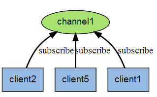
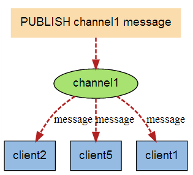

# Redis入门 - 发布订阅

Redis 发布订阅 (pub/sub) 是一种消息通信模式：发送者 (pub) 发送消息，订阅者 (sub) 接收消息。

此种模式下，消息发布者和订阅者不进行直接通信，发布者客户端向指定的频道（channel） 发布消息，订阅该频道的每个客户端都可以收到该消息，

Redis 客户端可以订阅任意数量的频道。

下图展示了频道 channel1 ， 以及订阅这个频道的三个客户端 —— client2 、 client5 和 client1 之间的关系：

当有新消息通过 PUBLISH 命令发送给频道 channel1 时， 这个消息就会被发送给订阅它的三个客户端：

Redis发布订阅命令：

- 订阅一个或多个频道：`subscribe channel1 [channel2 ... ]`
- 退订一个或多个频道：`unsubscribe [channel [channel ...]]`
- 订阅给定模式频道：`psubscribe pattern [pattern ...]`
- 退订给定模式频道：`punsubscribe [pattern [pattern ...]]`
- 发布命令：`publish channel message`
- 查看订阅与发布系统状态：`pubsub subcommand [argument [argument ...]]`