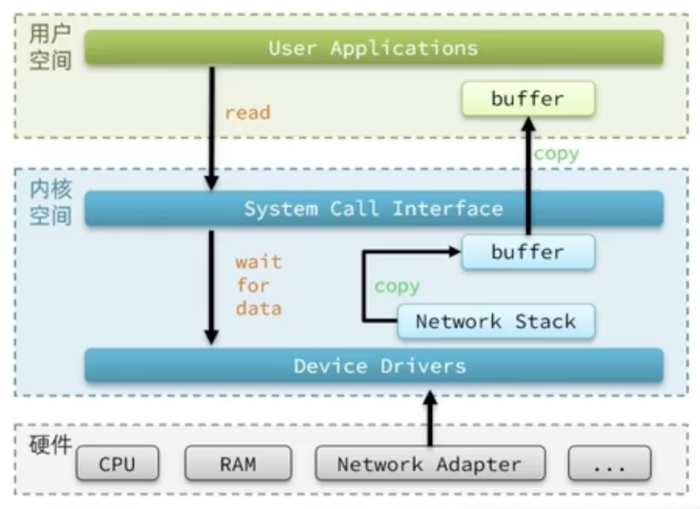
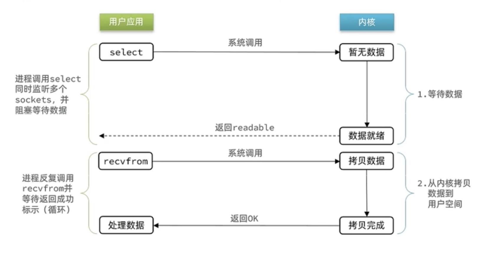
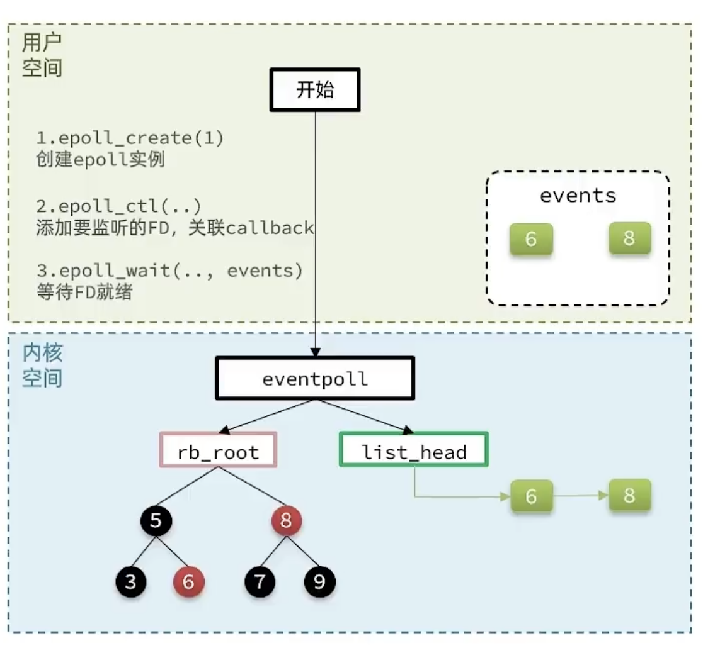
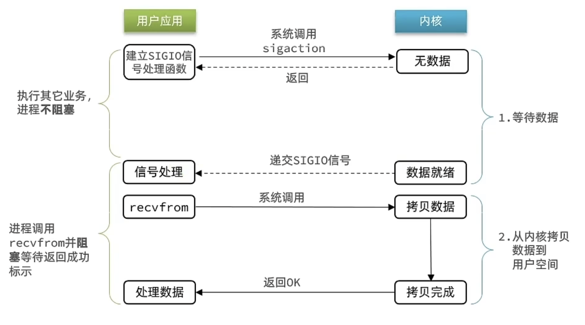

# Redis原理 - IO详解

## 用户空间与内核空间

任何Linux 系统的发行版，其系统内核都是 Linux 。我们的应用都需要通过 Linux 内核与硬件交互。


为了避免用户应用导致冲突甚至内核崩溃，用户应用与内核是分离的：

- 内存的寻址空间划分为两部分：内核空间、用户空间

> 32 位的操作系统，寻址地址就为 0 ~ $2 ^ {32}$

- 用户空间内只能执行受限的指令（Ring3），而且不能直接调用系统资源，必须通过内核提供的接口访问
- 内核空间可以执行特权命令（Ring0），调用一切系统资源

当进程运行在用户空间时称为用户态，运行在内核空间时称为内核态。

Linux 系统为了提高 IO 效率，会在用户空间和内核空间都加入缓冲区：

- 写数据时，要把用户缓冲数据拷贝到内核缓冲区，然后写入设备
- 读数据是，要从设备读取数据到内核缓冲区，然后拷贝到用户缓冲区



::: tip 5种IO模型

1. 阻塞 IO（Blocking IO）
2. 非阻塞 IO（Nonblocking IO）
3. IO 多路复用（IO Multiplexing）
4. 信号驱动 IO（Signal Driven IO）
5. 异步 IO（Asynchronous IO）
:::

## 阻塞IO

顾名思义，阻塞 IO 就是在**等待数据**和**拷贝数据到用户空间**两个阶段过程中都必须阻塞等待。


1. 用户线程发出 IO 请求
2. 内核会去查看数据是否准备就绪，如果没有准备就绪那么就会一直等待，而用户线程就会处于阻塞状态，用户线程处于阻塞状态
3. 当数据准备就绪以后，内核会将数据拷贝到用户线程，并返回结果给用户线程，用户线程才解除阻塞状态

可以看到，阻塞IO模型中，用户进程在两个阶段都是阻塞状态。

## 非阻塞IO

非阻塞 IO 的 recvfrom 操作会立即返回结果，而不是阻塞用户进程。


1. 等待数据阶段，如果数据没有就绪，则立刻返回 EWOULDBLOCK。这个过程用户进程是非阻塞的，但是用户进程会一直发起请求，忙轮训，直到内核处理才开始停止轮训。
2. 数据就绪以后，再将数据从内核中拷贝至用户空间。这个阶段用户进程是阻塞的。

可以看到，非阻塞 IO 模型中，用户进程在第一个阶段是非阻塞的，在第二个阶段是阻塞的。虽然是非阻塞的，但是性能并没有得到提高，而且忙等机制会导致 CPU 空转，CPU 使用率暴增。

## IO多路复用

无论是阻塞 IO 还是非阻塞 IO，用户应用在一阶段都是需要调用 recvfrom 来获取数据，差别在于无数据时的处理方式：
- 如果调用 recvfrom 时，恰好没有数据，阻塞 IO 会使进程阻塞，非阻塞 IO 会使CPU空转，均无法发挥 CPU 的作用。
- 如果调用 recvfrom 时，恰好有数据，则用户进程可以直接进入第二阶段，读取并处理数据

比如服务端处理客户端Socket 请求时，在单线程情况下，只能依次处理每一个 Socket，如果正在处理 socket 恰好未就绪（数据不可读或者不可写），线程就会被阻塞，所有其它客户端 socket 都必须等待，性能自然很差。

文件描述符（File Descriptor）：简称FD，是一个从 0 开始递增的无符号整数，用来关联 Linux 中的一个文件。在 Linux 中一切皆文件，例如常规文件、视频、硬件设备等，当然也包括网络套接字（Socket）

IO多路复用：是利用单个线程来同时监听多个 FD ，并在某个 FD 可读、可写时得到通知，从而避免无效的等待，充分利用 CPU 资源。



实现 IO 多路复用的技术有三种方式：

- select
- poll
- epoll

**差异：**
- select 和 poll 只会通知用户进程有FD就绪，但是不确定是那个 FD，需要用户进程逐个遍历 FD 来确认
- epoll 会通知用户进程 FD 就绪的同时，把已就绪的 FD 写入用户空间，直接能定位到就绪的 FD

### SELECT

select 是 Linux 中最早的 I/O 多路复用的实现方案：

```c
// 定义类型别名 __fd_mask，本质是 long int
typedef long int __fd_mask;

/* fd_set 记录要监听的fd集合，及其对应状态 */
typedef struct {
    // fds_bits是long类型数组，长度为 1024/32 = 32
    // 共1024个bit位，每个bit位代表一个fd，0代表未就绪，1代表就绪
    __fd_mask fds_bits[__FD_SETSIZE / __NFDBITS];
    // ...
} fd_set;


// select函数，用于监听多个fd的集合
int select(
    int nfds,// 要监视的fd_set的最大fd + 1
    fd_set *readfds,// 要监听读事件的fd集合
    fd_set *writefds,// 要监听写事件的fd集合
    fd_set *exceptfds,  // 要监听异常事件的fd集合
    // 超时时间，nulT-永不超时;0-不阻塞等待;大于0-固定等待时间
    struct timeval *timeout
);
```


具体流程如下：

1. 用户空间中创建 fd_set rfds
2. 假如要监听 fd = 1，2，5
3. 用户空间中执行 selec(5 + 1, rfds, null, null, 3)
4. 将用户空间中创建的 fd_set rfds 数组拷贝到内核空间中
5. 内核空间中遍历拷贝后的 fd_set rfds 数组
6. 如果没有就绪，则将该位置的 fd 设置为0。


**select模式存在的问题：**

- 需要将整个fd_set从用户空间拷贝到内核空间，select结束还要再次拷贝回用户空间
- select无法得知具体是哪个fd就绪，需要遍历fd_set
- fd_set监听的fd数量不能超过1024、

### POLL

poll 模式对 select 模式做了简单改进，但是性能提升并不明显，部分关键代码如下：
```c
// pollfd 中的事件类型
#define POLLIN      //可读事件
#define POLLOUT     //可写事件
#define POLLERR     //错误事件
#define POLLNVAL    //fd未打开

// pollfd结构
struct pollfd{
    int fd;             // 要监听的 fd
    *short int events;  // 要监听的事件类型:读、写、异常
    short int revents;  // 实际发生的事件类型
}

// poll函数
int poll(
    struct pollfd xfds, // pollfd数组，可以自定义大小
    nfds_t nfds,        // 数组元素个数
    int timeout         // 超时时间
);
```
**IO 流程：**

1. 创建 pollfd 数组，向其中添加关注的fd 信息，数组大小自定义
2. 调用 poll 函数，将 pollfd 数组拷贝到内核空间，转链表存储，无上限
3. 内核遍历 fd ，判断是否就绪
4. 数据就绪或超时后，拷贝 pollfd 数组到用户空间，返回就绪 fd 数量 n
5. 用户进程判断 n 是否大于 0
6. 大于 0 则遍历 pollfd 数组，找到就绪的 fd 

**与 SELECT 比较：**
- select 模式中的 fd_set 大小固定值为 1024 ，而 pollfd 在内核中采用链表，理论上是无限的
- 监听的 FD 越多，每次遍历消耗的时间也越久，性能反而会下降

### EPOLL

epoll 模式是对 select 和 poll 模式的改进， 提供了三个函数：

```c
struct eventpoll{
    //...
    struct rb_root rbr; // 一颗红黑树，记录要监听的fd
    struct list_head rdlist;  // 一个链表，记录就绪的 FD
    //...
}

// 1.会在内核创建eventpolL结构体，返回对应的句柄epfd
int epoll create(int size);

// 2.将一个FD添加到epol的红黑树中，并设置ep_poli_calLback
// calTback触发时，就把对应的FD加入到rdlist这个就绪列表中
int epoll _ctl(
    int epfd,   // epoll实例的句柄
    int op,     // 要执行的操作，包括：ADD、MOD、DEL
    int fd,     // 要监听的 FD
    struct epoll_event *event // 要监听的事件类型: 读、写、异常等
);

// 3.检查rdlist列表是否为空，不为空则返回就绪的FD的数量
int epoll wait(
    int epfd,       // eventpoll 实例的句柄
    struct epoll_event *events, // 空event 数组，用于接收就绪的 FD
    int maxevents,  // events 数组的最大长度
    int timeout // 超时时间，-1永不超时;0不阻塞;大于0为阻塞时间
);
```




### 事件通知机制

当 FD 有数据可读时，我们调用 epoll_wait 就可以得到通知，但是时间通知的模式有两种：

- LevelTriggered：简称 LT。当 FD 有数据可读时，会重复通知多次，直至数据处理完成。是 epoll 的默认模式。
- EdgeTriggered：简称 ET。当 FD 有数据可读时，只会通知一次，不管数据是否被处理完成

::: info 举个例子
1. 假设一个客户端 Socket 对应的 FD 已经注册到了 epoll 实例中
2. 客户端 Socket 发送了 2kb 的数据
3. 服务端调用 epoll_wait ，得到通知说 FD 就绪
4. 服务端从 FD 读取了 1kb 的数据
5. 回到步骤三（再次调用 epoll_wait ，形成循环）
:::

结论

- ET 模式避免了 LT 模式可能出现的惊群现象
- ET 模式最好结合非阻塞 IO 读取 FD 数据，相比 LT 会复杂一些

### WEB服务流程

基于 epoll 模式的 web 服务的基本流程图：


### 总结

**select 模式的存在的三个问题：**

- 能监听的 FD 最大不超过 1024 个
- 每次 select 都需要把所有要监听的 FD 都拷贝到内核空间
- 每次都要遍历所有 FD 来判断就绪状态

**poll 模式的问题：**

- poll 利用链表解决了 select 中监听 FD 上限的问题，但是依然要遍历所有的 FD ，如果监听较多，性能会下降

**epoll 模式中如何解决这些问题:**

- 基于 epoll 实例中的红黑树保存要监听的 FD ，理论上无上限，而且增删改查效率都非常高，性能不会随监听的 FD 数量增多而产生显著的下降
- 每个 FD 只需要执行一次 epoll_ctl 添加到红黑树，以后每次 epoll_wait 无需传递任何参数，无需重复拷贝 FD 到内核空间
- 内核会将就绪的 FD 直接拷贝到用户空间的指定位置，用户进程无需遍历所有 FD 就能知道就绪的 FD 是谁

## 信号驱动IO

信号驱动 IO 是与内核建立 SIGIO 的信号关联并设置回调，当内核有 FD 就绪时，会发出 SIGIO 信号通知用户，期间用户应用可以执行其他业务，无需阻塞等待。



当有大量 IO 操作时，信号较多，SIGIO 处理函数不能及时处理可能导致信号队列溢出。

而且内核空间与用户空间的频繁信号交互性能也较低。

## 异步IO

异步 IO 的整个过程都是非阻塞的，用户进程调用完异步 API 后就可以去做其他事情，内核等待数据就绪并拷贝到用户空间后才会递交信号，通知用户进程。


在异步 IO 模型中，用户进程在两个阶段都是非阻塞的状态。

异步 IO 模型虽然很简单，但是在高并发的访问下，内核中会处理大量请求，容易导致内核崩溃。

## 同步和异步
IO 操作是同步还是异步，关键看数据在内核空间与用户空间的拷贝过程（数据读写的IO操作），也就是阶段二是同步还是异步：

