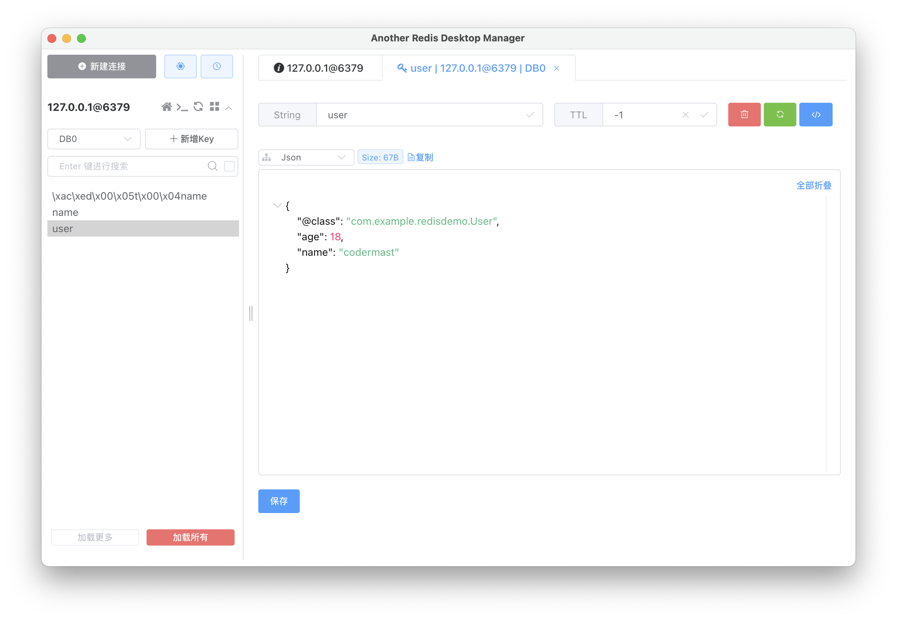

# Redis客户端 - RedisSerializer

::: note 前景回顾
在上一篇中，我们实现了一个简单的案例，操作一个 String 类型的数据，插入了一个 name = codermast 的数据到Redis。
:::

使用redis-cli客户端连接对应的Redis服务器后，按道理来讲`get name`这个指令的返回结果应该是 `codermast`


返回的结果是无，这是为什么呢？使用可视化工具查看一下，看看到底数据是否存储在Redis服务器中。


可以明显的看到，所存储的 key 之前加上了一段字符，但是从代码中看，存储的 key 为 "name"，但是实际存储的 key 是 `\xac\xed\x00\x05t\x00\x04name`，而且里面的 value 也做了同样的处理 `\xac\xed\x00\x05t\x00\x09codermast`

出现这种现象的原因是什么呢？这是因为 RedisTemplate 在底层将数据序列化处理以后，才存储到 Redis 服务器中。

RedisTemplate 可以接收任意 Object 作为值写入 Redis ，只不过在写入之前会把 Object 序列化成为字节形式，默认是采用 JDK 序列化，得到的结果就如图所示。
::: warning 缺点
- 可读性差
- 资源占用高
:::


既然这样可读性又差，资源占用又高，那么如何解决这些问题呢？我们可以通过自定义 RedisTemplate 序列化的方式来解决。

## 编写一个 RedisConfig 配置类

```java
@Configuration
public class RedisTemplate{
    @Bean
    public RedisTemplate<String, Object> redisTemplate(RedisConnectionFactory factory){

        // 1.创建RedisTemplate对象
        RedisTemplate<String ,Object> redisTemplate = new RedisTemplate<>();

        // 2.设置连接⼯⼚
        redisTemplate.setConnectionFactory(factory);
        
        // 3.创建序列化对象
        StringRedisSerializer stringRedisSerializer = new StringRedisSerializer();
        GenericJackson2JsonRedisSerializer genericJackson2JsonRedisSerializer = new GenericJackson2JsonRedisSerializer();
        
        // 4.设置 key 和 hashKey 采⽤ String 的序列化⽅式
        redisTemplate.setKeySerializer(stringRedisSerializer);
        redisTemplate.setHashKeySerializer(stringRedisSerializer);
        
        // 5.设置 value 和 hashValue 采⽤ json的 序列化⽅式
        redisTemplate.setValueSerializer(genericJackson2JsonRedisSerializer);
        redisTemplate.setHashValueSerializer(genericJackson2JsonRedisSerializer);

        return redisTemplate;
    }
}
```
::: warning 注意
我们自定义的配置类中，使用到了 Jackson 序列化类，所以在使用之前需要导入 jackson-datebind 这个依赖项。

```xml:no-line-numbers
<!-- jackson-databind 依赖 -->
<dependency>
    <groupId>com.fasterxml.jackson.core</groupId>
    <artifactId>jackson-databind</artifactId>
</dependency>
```
:::

## 自定义序列化方式

自定义的序列化方式也加进去了对引用类型的序列化，我们来实际测试一下。

- 编写一个 User 类

```java
@Data
public User{
    Integer age;
    String name;
}
```

> 类中属性需要给出 set 和 get方法

- 将 User 对象存储至 Redis

```java
@Test
void testObject(){
    User user = new User();
    user.setAge(18);
    user.setName("codermast");

    // 插入一条 Object 类型的数据
    redisTemplate.opsForValue().set("user",user);

    // 获取一条 Object 类型的数据
    User user_coder = (User)redisTemplate.opsForValue().get("user");

    System.out.println(user_coder);
}
```



虽然 JSON 的序列化方式可以满足我们存储对象的需求，为了在反序列化时知道对象的类型，将对象的类路径地址也序列化进 JSON 结果中，存入 Redis ，会带来额外的资源消耗。

针对如图所示的特殊情况，类路径地址比我们真实的数据内容还大，造成了极大的资源浪费。

## 优化自定义序列化

为了节省内存空间，通常情况下不会使用 JSON 序列化器来处理 Value ，而是统一使用 String 序列化器，要求只能存储 String 类型的 key 和 value。当要存储 Java 对象时，手动完成对象的序列化和反序列化。


Spring 默认提供了一个 StringRedisTemplate 类，它的 key 和 value 的序列化方式默认就是 String 方式，省去了我们自定义的 RedisTemplate 的过程。

现在在存储数据之前需要进行手动序列化，在获取数据以后，需要手动反序列化对象。


## 小结

RedisTemplate 的两种序列化实践方案

1. 方案一
    - 自定义RedisTemplate
    - 修改RedisTemplate 的序列化器为 GenericJackson2JsonRedisSerializer
2. 方案二
    - 使用 StringRedisTemplate
    - 写入 Redis 之前，将对象手动序列化为 JSON
    - 读取数据以后，将 JSON 手动反序列化为对象

::: tip 
上述仅说明了操作 String 类型的数据，操作 Hash、List、Set、SortedSet类型时，使用对应的 ops 对象即可操作。
:::