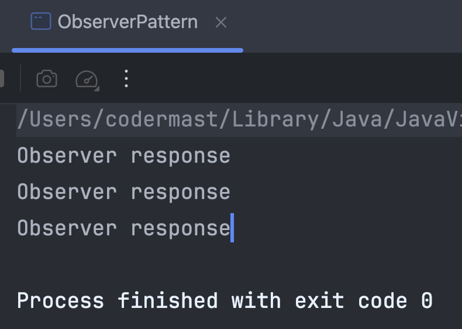

# 观察者模式

观察者模式属于行为型模式，定义了对象之间的一对多的依赖关系，在这种模式中，当一个对象的状态发生变化时，所有依赖于它的对象都会得到通知，并且执行相关操作。观察者模式又被成为“发布—订阅模式”，即发布者发生改变后，会通知所有订阅者。

## 设计思想

在现实生活中，许多对象并不是独立存在的，其中一个对象发生变化后，往往也会影响其他对象的变化，程序设计中也是如此。当一个对象发生改变后，经常会影响其他对象也发生变化，而想要及时的知道这些变化，就需要对其进行监听，简单的监听就是无限轮训查看，费时费力且效率不高，那么这种情况下就可以使用到观察者模式。


**优点**


1. 降低了目标和观察者之间的耦合，两者之间是抽象耦合关系。
2. 目标与观察者建立了一套触发机制。

**缺点**

1. 目标与观察者之间的依赖关系并没有完全解除，而且可能出现循环引用。
2. 由于是目标通知观察者，当观察者过多时，通知会消耗大量性能，影响程序效率。

::: warning 循环引用
这里说明一下这个循环引用，目标和观察者并不是其绝对的身份，有可能一个对象即是目标也是观察者，当两个对象相互观察时，一旦一个对象发生变化，则会无限循环的互相通知，这时就是循环引用。
:::


## 实现案例

### 实现逻辑

在具体实现观察者模式之前，需要注意具体目标对象和具体观察者对象之间不能直接调用，否则将使两者之间紧耦合，这违反了面向对象程序的设计原则。

观察者模式的标准结构如下：

1. 抽象目标对象：本质上是一个抽象目标类，它提供了一个用于保存观察者对象的集合和增加、删除观察者对象的方法，以及通知所有观察者的抽象方法。

2. 具体目标对象：也叫具体目标类，它实现抽象目标中的通知方法，当具体主题的内部状态发生变化时，通知所有注册过的观察者对象。

3. 抽象观察者对象：本质上是一个抽象类或者接口，它包含了一个更新自己的抽象方法，以便于接到具体主题的更改通知时被调用。

4. 具体观察者对象：实现抽象观察者对象中定义的接口或者抽象方法，以便在得到目标的更改通知时，更新自身的状态。

### 具体实现

- 抽象目标

```java
interface Target {
    // 添加观察者
    public void addObserver(Observer observer);

    // 删除观察者
    public void removeObserver(Observer observer);

    // 通知观察者
    public void notifyObservers();
}
```

- 具体的目标对象

```java
class User implements Target {
    // 注册的观察者对象集合
    List<Observer> observers = new ArrayList<>();

    // 添加观察者
    @Override
    public void addObserver(Observer observer) {
        observers.add(observer);
    }

    // 删除观察者
    @Override
    public void removeObserver(Observer observer) {
        observers.remove(observer);
    }

    // 通知观察者
    @Override
    public void notifyObservers() {
        for (Observer observer : observers) {
            observer.response();
        }
    }
}
```

- 抽象观察者

```java
interface AbstractObserver {
    // 反应
    void response();
}
```

- 具体的观察者

```java
class Observer implements AbstractObserver {

    @Override
    public void response() {
        // 这里写观察者的反应
        System.out.println("Observer response");
    }
}
```

- 测试

```java
public static void main(String[] args) {
    Target user = new User();

    Observer observer1 = new Observer();
    Observer observer2 = new Observer();
    Observer observer3 = new Observer();

    user.addObserver(observer1);
    user.addObserver(observer2);
    user.addObserver(observer3);

    user.notifyObservers();
}
```



## 小结

观察者模式的优点在于它提供了一种松耦合的方式，让观察者和主题之间的依赖关系变得更加灵活，同时也可以使得程序更易于扩展和维护。

观察者模式的应用场景包括：当一个抽象模型有两个方面，其中一个方面依赖于另一个方面时；当一个对象的改变需要同时改变其他对象的时候；当一个对象的改变需要通知其他对象而又不希望与被通知对象形成紧耦合关系时。
