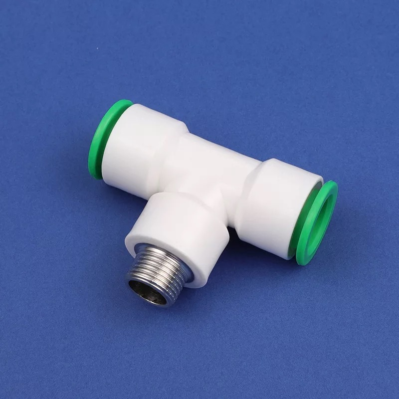

# 适配器模式

适配器模式是一种结构型模式，可以将一个类的接口转换成客户端所期望的另一种接口，适配器模式可以帮助开发人员在不修改现有代码的情况下，将不兼容的类组合在一起。




举个例子，我们经常使用到的水管的适配器，当两根水管的直径、材质等都不相同时，很难直接将其进行连接，如果使用适配器就很容易将其进行连接。

适配器模式中主要包含以下几个组成部分：

- 目标接口（Target Interface）：客户端期望的接口。
- 适配器（Adapter）：充当两个不兼容的接口之间的桥梁，使得他们可以互相通信。
- 适配者（Adaptee）：需要被适配的对象，它的接口和客户端期望的目标接口不兼容。
- 客户端（Client）：使用目标接口的对象

## 设计思想

适配器模式就是编程思想中面向切面典型的加一层，即在两层不兼容的切面中间加一层，对下层提供的接口进行封装，包装后提供给上层服务。

- 当需要将一个已有的类或接口与另一个不兼容的类或接口进行协同工作时。

- 当需要对一个已有的类或接口进行修改，以满足客户端的需求时，但是不希望修改该类或接口的源代码。

- 当需要重新使用一个已有的类或接口，但是不能直接使用该类或接口的方法时。

## 实现案例

- 目标接口 Target

```java
interface Target {
    void request();
}
```
- 不兼容的适配者 Adaptee

```java
class Adaptee {
    void specificRequest() {
        System.out.println("Adaptee specificRequest.");
    }
}
```

- 适配器 Adapter

```java
class Adapter implements Target {
    private Adaptee adaptee;

    public Adapter(Adaptee adaptee) {
        this.adaptee = adaptee;
    }

    @Override
    public void request() {
        adaptee.specificRequest();
    }
}
```

- 客户端

```java
public class AdapterPatternDemo {
    public static void main(String[] args) {
        Adaptee adaptee = new Adaptee();
        Target target = new Adapter(adaptee);
        target.request();
    }
}
```

## 小结


适配器模式是一种非常有用的设计模式，在 JDK、操作系统 中被广泛应用，可以向上提供一致的接口

1. Java IO 流是一个常见的适配器模式的例子，他提供了一组标准的接口来访问各种类型的数据源，包括文件、网络连接、内存等，每个数据源都有自己的接口，但是 Java IO 流可以将这些不同的接口转换为标准的接口，从而提供一致的访问方式。

2. Java Servlet API 也是一个常见的适配器模式的例子。它定义了一组接口来处理 HTTP 请求和响应，包括 doGet()、doPost()、doPut() 等等。每个 Servlet 都必须实现这些接口，但是用户只需要实现其中的一部分即可。这些 Servlet 之间的适配工作由 Servlet 容器完成。

3. 操作系统中对外设的管理，不同的外设有不同的接口，操作系统根据其功能的划分，对这些外设提供的接口进行封装，向用户提供了统一的接口。