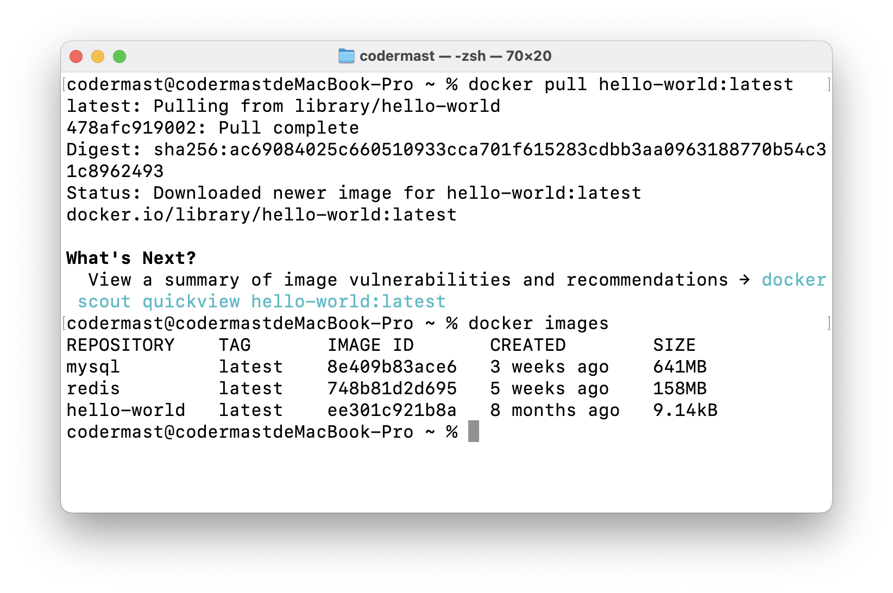
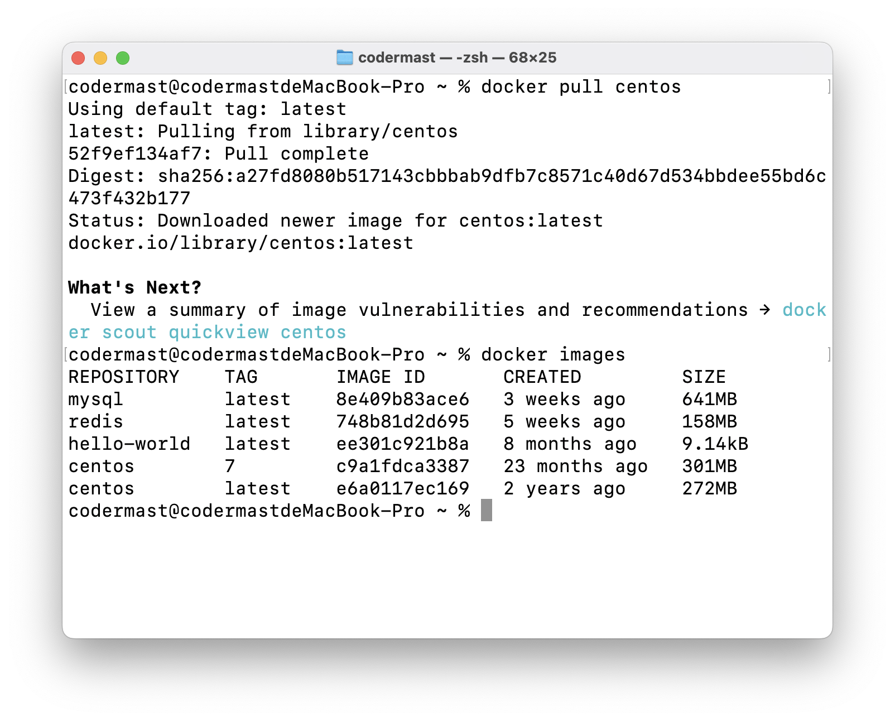

# Docker - HelloWorld

::: tip 提示

在学习本小节之前，你必须确保你正确安装了 Docker，正确安装 Docker 是后续学习的前提，务必确保你已经成功安装。

另外当你在学习本小节时，可能会出现你完全按照教程进行，但是运行结果并不与教程相符合的情况。这种情况不必担心，因为 Docker 镜像源默认是在海外，国内访问可能不够稳定，在后续的章节中会一一解决这些问题。

在本章节中的所有关于 Docker 的专有名词，如 镜像、容器、仓库等，不理解属于正常情况，这些内容都会在后续中进行讲解。

本小节的目的是为了让大家对 Docker 的运行有一个简单的认识，仅此而已。

如未能成功运行，可先学习自本小节起的后续章节，学习完成后可回头做此学习案例。
:::

## Hello World容器样例

1. 拉取 hello-world 镜像
```sh
docker pull hello-world:latest
```


2. 查看本地仓库是否有 hello-world 这个库

```sh
docker images
```



3. 运行这个镜像的容器，即实例

```sh
docker run hello-world
```


## Centos容器样例

> 在 Centos 环境下执行 `/bin/echo "Hello world"`指令

1. 拉取 Centos 镜像

```sh
docker pull centos
```


2. 查看本地仓库是否有 Centos7 这个镜像

```sh
docker images
```



3. 运行这个镜像的容器，即实例

```sh
docker run centos /bin/echo "Hello world"
```

