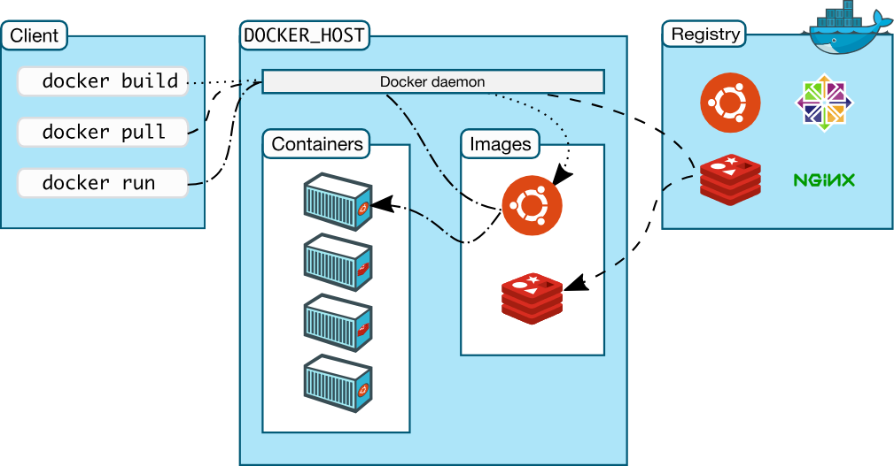
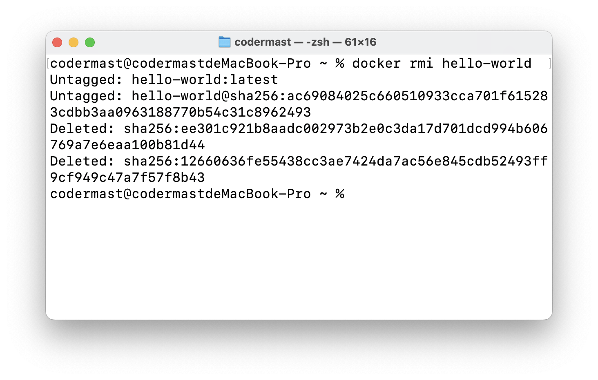
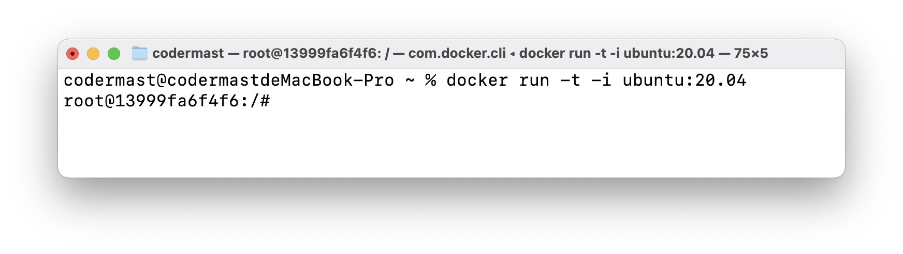
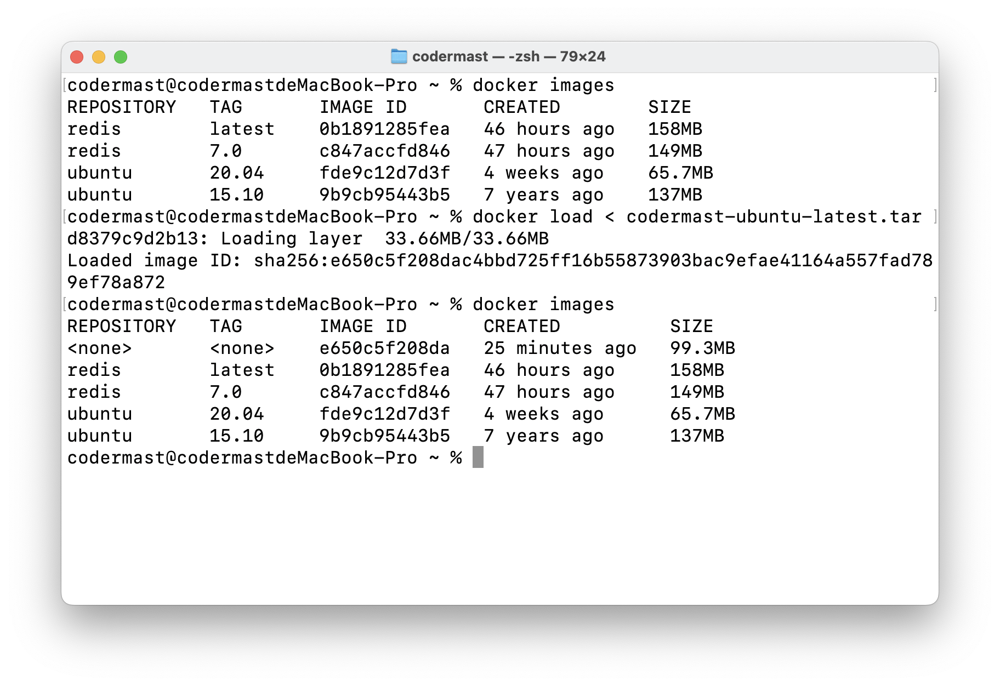
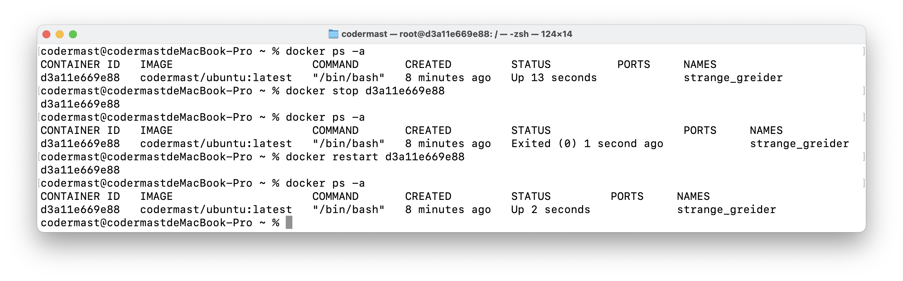

# Docker - 镜像、容器、仓库

::: tip 
这个章节涉及到 Docker 最核心的知识，也是在使用过程中最常使用到的，需要重点学习。
:::

## 什么是Docker镜像、容器、仓库？

- Docker镜像：镜像是一个只读的模板，其中包含了创建 Docker 容器的说明，可以用来创建 Docker 容器。镜像可以包含操作系统、应用程序、依赖库、配置文件等。

- Docker容器：容器是代码的隔离环境。这意味着容器并不直接在操作系统上运行。容器是 Docker 镜像的一个运行实例，可以理解为一个轻量级的虚拟机，用面向对象的思想来看，其就是一个镜像的运行对象。容器包含了运行应用程序所需的所有组件，包括操作系统、应用程序、依赖库等。

- Docker仓库：仓库是用来存储和管理 Docker 镜像的地方，类似于代码仓库。Docker 官方提供了 Docker Hub 仓库，可以在其中存储和分享 Docker 镜像。用户也可以自建私有仓库来存储和管理自己的 Docker 镜像。


## 镜像、容器、仓库之间的关系




Docker 镜像可以看做是一个静态模板，Docker 容器是对镜像的一个实例化，一个镜像可以实例化多个容器，这几个容器相互独立，互不影响。

Docker 仓库就是存放 Docker 镜像的地方，严格意义上来说可以分为本地仓库和远程仓库，远程仓库由 Docker 官方维护，包含了几乎所有的 Docker 镜像，Docker 本地仓库只有你拉取的镜像。

在使用 Docker 镜像创建对象之前，需要先拉取 Docker 镜像，这里的拉取通常是指从 Docker 官方仓库拉取。

故使用 Docker 的基本步骤可以清晰的总结为：

1. 从仓库拉取 Docker 镜像

2. 使用 Docker 镜像实例化一个 Docker 容器

3. 运行 Docker 容器

## Docker镜像

当运行容器时，使用的 Docker 镜像不在本地仓库中，Docker 就会从默认的 Docker 仓库中下载该镜像。一般是从 Docker 官方提供的 Docker Hub 仓库中下载。

下面来学习关于 Docker 镜像的相关操作。

### 镜像列表

```sh
docker images
```


- REPOSITORY：表示镜像的仓库源
- TAG：镜像的标签, 同一仓库源可以有多个 TAG，代表这个仓库源的不同个版本
- IMAGE ID：镜像ID
- CREATED：镜像创建时间
- SIZE：镜像大小

### 查找镜像

::: warning
本小节以查找 Redis 镜像为例做演示说明，其他镜像的操作同理。
:::

1. **在 Docker Hub查找**

使用 Docker Hub 中提供的查找功能：https://hub.docker.com/search?q=redis&type=image

这里就已经找到了 Redis 的镜像信息


可以查看 Redis 镜像的各种版本信息。


2. **使用 Docker Search查找**

```sh
docker search redis
```


- NAME: 镜像仓库源的名称
- DESCRIPTION: 镜像的描述
- OFFICIAL: 是否 docker 官方发布
- STARS: 类似 Github 里面的 star，表示点赞、喜欢的意思。
- AUTOMATED: 自动构建。

3. **使用 Docker Desktop 查找**


直接在 Docker Desktop 中搜索即可。

### 拉取镜像

拉取镜像即从 Docker 仓库中拉取 Docker 镜像，本质上就是从远程的仓库中下载镜像到本地。

> 这里仍以 Redis 为样例进行编写，其他镜像的拉取同理。

```sh
docker pull redis
```


这里默认拉取的是 Redis 的最新版本，如果要是想拉取指定版本时可以进行如下执行，如拉取 redis7.0

```sh
docker pull redis:7.0
```


### 删除镜像

这里我们演示删除之前下载的那个 Hello-World 镜像

```sh
docker rmi hello-world
```



这里如果使用了该镜像创建了容器，那么就会报错。


如果出现这种情况，就说明我们使用了该镜像创建了容器，那么就必须先删除使用该镜像的所有容器，才能够删除该镜像。

- 先查看 Docker 容器

```sh
docker ps -a
```


- 然后删除 Docker 容器

```sh
docker rm 8c0dde3e3fb4
```


使用的是 Docker 容器的 ID 删除。

- 删除 Docker 镜像

```sh
docker rmi hello-world
```


::: tip 
如果一个镜像创建了多个容器，那么在删除该镜像之前，必须删除所有使用该镜像的容器，才能够删除该镜像。
:::

### 更新镜像

Dokcer 镜像的更新就是在目前运行的 Docker 容器上进行修改，然后将更新后的 Docker 容器的所有内容，导出为一个 Docker 镜像，随后就可以使用该镜像创建 Docker 容器。

1. 先下载一个 Ubuntu20.04 镜像

```sh
docker pull ubuntu:20.04
```


2. 创建一个该镜像的容器

```sh
docker run -t -i ubuntu:20.04
```



3. 在该容器内运行 `apt-get update` 指令，更新 ubuntu 系统，更新后 `exit` 退出这个容器到我们本地的命令控制端。

```sh
apt-get update
```


4. 提交容器副本
```sh
docker commit -m="update ubuntu20.04" -a="CoderMast" 13999fa6f4f6 codermast/ubuntu:latest
```


各个参数说明：

- -m: 提交的描述信息

- -a: 指定镜像作者

- 13999fa6f4f6：容器 ID

- codermast/ubuntu:latest: 指定要创建的目标镜像名

5. 查看镜像列表

```sh
docker images
```


这里可以看到已经创建成功了，并且大小和之前的不一样了。

6. 使用该镜像创建一个容器

```sh
docker run -t -i codermast/ubuntu:latest
```


### 生成镜像


### 镜像标签

我们可以使用 `docker tag` 命令为镜像添加一个新的标签。

```sh
docker tag e650c5f208da codermast/ubuntu:v1
```

- e650c5f208da：为镜像的 ID
- codermast/ubuntu:v1：Tag 名


此时我们在创建 Docker 容器时，既可以使用 `codermast/ubuntu:latest` 也可以使用 `codermast/ubuntu:v1`。

Tag 可以看做是给镜像起别名，其本质的镜像 ID 不变，具体底层就是同一个镜像的不同引用而已。

### 镜像导入和导出

1. 镜像导出
```sh
docker save > codermast-ubuntu-latest.tar e650c5f208da
```
- codermast-ubuntu-latest.tar：要导出的文件名
- e650c5f208da：要导出的镜像 ID


2. 镜像导入

在镜像导入之前，为了方便观察，先删除掉该镜像。

```sh
docker load < codermast-ubuntu-latest.tar
```

- codermast-ubuntu-latest.tar：为要导入的文件名。



::: warning 注意
- 若是只想备份images，使用save、load即可
- 若是在启动容器后，容器内容有变化，需要备份，则使用export、import
:::

## Docker容器

在上面的 Docker 镜像的相关操作中，我们或多或少的了解和学习了一些 Docker 容器的相关操作。

### 容器启动

```sh
docker run -it codermast/ubuntu:latest /bin/bash
```

- -it 可以连写的，表示 -i -t
- -t: 在新容器内指定一个伪终端或终端。
- -i: 允许你对容器内的标准输入 (STDIN) 进行交互
- codermast/ubuntu:latest：镜像名称


### 容器查看

```sh
docker ps -a
```

- -a 表示 all，即查看所有容器


### 容器再启动

我们看到，刚才 `codermast/ubuntu:latest` 的实例`d3a11e669e88` 已经停止了`Exited (0) 4 seconds ago`，我们重启这个实例

```sh
docker start d3a11e669e88
```


### 容器停止和重启

- 容器停止
```sh
docker stop d3a11e669e88
```
- 容器重启
```sh
docker restart d3a11e669e88
```



### 后台模式与进入

在使用 -d 参数创建容器时，容器启动后会进入后台，那么此时我们怎么进入容器呢？


- 使用 `docker attach [容器ID]

```sh
docker attach d3a11e669e88
```


- `docker exec -i -t [容器ID] /bin/bash`

```sh
docker exec -i -t d3a11e669e88 /bin/bash
```


::: warning 注意

- `docker attach` 在退出容器终端后，容器会停止运行。

- `docker exec` 在退出容器终端后，不会导致容器的停止。

✅ 推荐大家使用 `docker exec`
:::


### 容器导出和导入

1. 容器的导出
```sh
docker export 246b23d5d5a5 > redis-latest-codermast.tar
```
- 246b23d5d5a5：容器 ID
- redis-latest-codermast.tar：导出文件名


2. 容器的导入

```sh
docker import redis-latest-codermast.tar codermast/redis:latest
```
- redis-latest-codermast.tar：配置文件名
- codermast/redis:latest：导入的镜像名称


> 要注意的是，这里是对 Docker 容器进行导出，但是导出的结果是镜像的配置文件，通过该配置文件导入的也是 Docker 镜像。
>
> 

### 强制删除容器

我们知道，当容器在运行的时候是无法直接删除的，需要先将容器先停止运行，随后才能删除该容器，那么能不能直接删除正在运行中的容器呢？

答案是可以的，我们只需要在其中加上 `-f` 的选项即可，代表 `force` 强制的意思。

```sh
docker rm -f b234f112186d

```

- b234f112186d：为 正在运行 Docker 容器的 ID


### 清理停止的容器

在容器停止运行后，并不会自动被删除，需要手动清除。该指令一次性清除所有的停止状态的容器。

```sh
docker container prune
```


### 容器别名及操作


上述对容器的操作都是针对容器 ID，这个 ID 是随机的，为了方便起见，我们可以设置一个自定义的 name 来进行操作。仅需在指令中设置 `name` 选项即可。


```sh
docker run -d --name codermast-redis-001 redis:latest
```

- codermast-redis-001：自定义的名称
- redis:latest：镜像名称


### 容器错误日志

```sh
docker logs ...
```

- 实时查看docker容器名为user-uat的最后10行日志

`docker logs -f -t --tail 10 user-uat`

- 查看指定时间后的日志，只显示最后100行：

`docker logs -f -t --since="2024-01-14" --tail=100 user-uat`

- 查看最近30分钟的日志:

`docker logs --since 30m user-uat`

- 查看某时间之后的日志：

`docker logs -t --since="2024-01-14T21:00:00" user-uat`

- 查看某时间段日志：

`docker logs -t --since="2024-01-14T21:00:00" --until "2018-02-09T12:23:37" user-uat`

- 将错误日志写入文件：

`docker logs -f -t --since="2024-01-14" user-uat | grep error >> logs_error.txt`

## Docker仓库 

Docker 仓库是集中存放 Docker 镜像的地方。默认使用的仓库为 Docker Hub，也可以更改为自己的想使用的仓库。类似于 Github 的仓库，只不过 Github 管理的是代码，Docker Hub 管理的是 Docker 镜像。


这里以 Docker Hub 为例进行说明。

1. 登录仓库

```sh
docker login
```

2. 将准备好的镜像推送至仓库

```sh
docker push codermast/redis:latest
```

- codermast/redis:latest：Docker 镜像名

