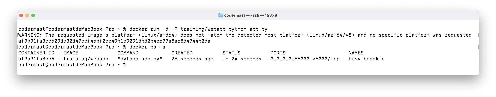
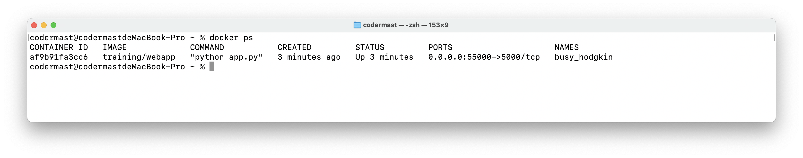

# Docker - WEB容器

在之前的章节中，仅对普通容器进行了演示，但在实际中常常使用到 Docker 容器中的 WEB 应用程序。

## 运行一个WEB应用


1. 拉取镜像

```sh
docker pull training/webapp
```


2. 创建一个容器

```sh
docker run -d -P training/webapp python app.py
```



> 这里出现了警告信息，是因为我的电脑是 M1 芯片，是 ARM 架构，而所需要的平台是请求的映像的平台（linux/aamd64）与检测到的主机平台（linux/alm64/v8）不匹配，这里每个人的电脑环境不同，不必理会。

- -d:让容器在后台运行。

- -P:将容器内部使用的网络端口随机映射到我们使用的主机上。


## 查看WEB应用容器

```sh
docker ps
```



我们看到这里增加了端口的映射，`0.0.0.0:55000->5000/tcp`，即将本地 IP 的 55000 端口，映射到了该 Docker 容器中的 5000 端口，即我们在本地访问 55000 端口，即可访问该 Docker 容器。


## 设置自定义映射端口

在上面的例子中，使用 `-p` 参数映射到主机上的端口是随机的，下面我们对其进行端口的自定义操作。

为了便于和前面创建的容器进行区分，我们再创建一个容器。

```sh
docker run -d -p 55001:5000 training/webapp python app.py
```


访问 `localhost:55001`


## 停止WEB应用容器

WEB 应用容器，本身就是一个 Docker 容器，使用 Docker 本身的停止命令即可。

```sh
# 通过 Docker 容器名称停止
docker stop busy_hodgkin

# 通过 Docker 容器 ID 停止
docker stop af9b91fa3cc6
```

## 重启WEB应用容器

```sh
# 通过 Docker 容器名称重启
docker restart busy_hodgkin

# 通过 Docker 容器 ID 重启
docker restart af9b91fa3cc6
```

## 删除WEB应用容器

```sh
docker rm busy_hodgkin
```

这里要注意，该指令是无法直接删除运行中的容器，想要直接删除需要加上 `-f` 选项

```sh
docker rm -f busy_hodgkin
```
