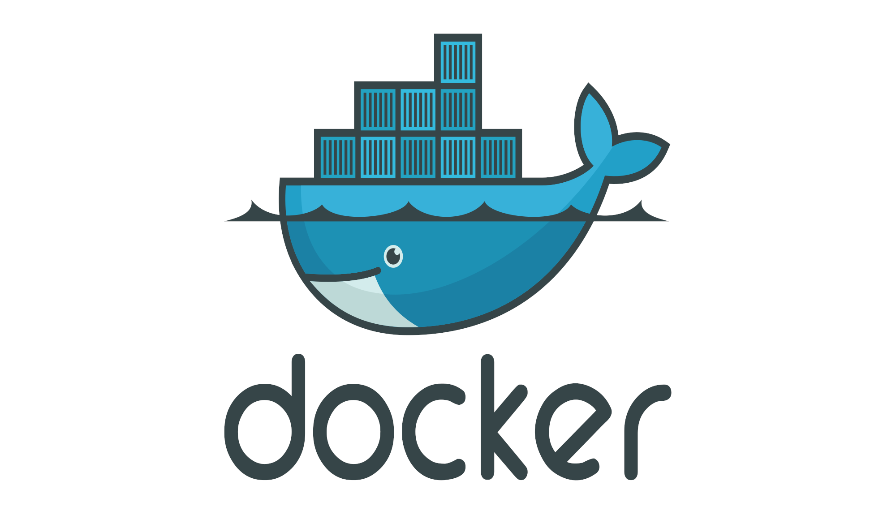

# Docker 学习笔记

## 目录

<Catalog  hideHeading='false'/>

## 为什么要写这个系列？

众所周知，Docker的教程网络上非常多，也不乏有许多大佬，整理和总结的笔记都很优秀。但是对于我（一个Java后端开发人员）来说，目前市面上的Docker要么过于繁琐，要么过于精炼。过于繁琐学起来费时费力，过于精炼又不能达到我快速掌握 Docker 核心的目的，当然也不是说这些教程不好，只是针对我来说，并不是我所需求的，故此就开了 Docker 这个篇章。也顺便记录自己学习 Docker 的一些学习心得和笔记，希望能够帮到你。