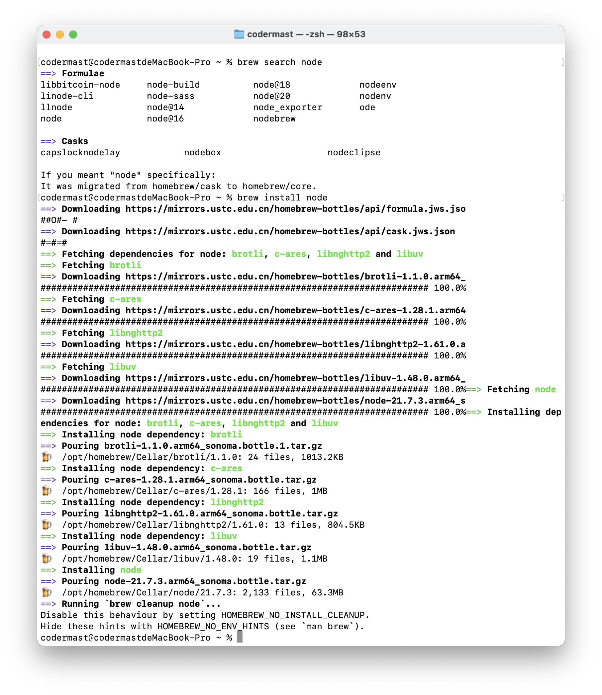
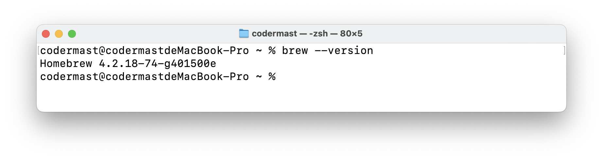

# HomeBrew 教程


## 介绍

::: tip 官方描述
Homebrew is the easiest and most flexible way to install the UNIX tools Apple didn’t include with macOS. It can also install software not packaged for your Linux distribution without requiring sudo.
:::

Homebrew 是安装苹果没有包含在 macOS 中的 UNIX 工具的最简单、最灵活的方式。它还可以安装不适合您的 Linux 发行版的软件，而不需要 sudo。

使用 Homebrew 可以安装 Mac（或Linux）没有预装但你需要的东西。

总的来说，Homebrew 是一款在 UNIX 平台下的软件安装管理器，又或者包管理器。

## 安装

### 官方安装
::: info 官方地址
- 官网：https://brew.sh/
- 中文：https://brew.sh/zh-cn/
:::

- 安装指令

```sh
/bin/bash -c "$(curl -fsSL https://raw.githubusercontent.com/Homebrew/install/HEAD/install.sh)"
```

### 国内镜像

- 安装指令

```sh
/bin/zsh -c "$(curl -fsSL https://gitee.com/cunkai/HomebrewCN/raw/master/Homebrew.sh)"
```

- 卸载指令

```sh
/bin/zsh -c "$(curl -fsSL https://gitee.com/cunkai/HomebrewCN/raw/master/HomebrewUninstall.sh)"
```

- Gitee 仓库：https://gitee.com/cunkai/HomebrewCN

## 常用指令

### 更新brew

定期更新 Brew 可以确保您拥有最新的软件包和版本

```sh
brew update 
```

### 搜索软件包

```sh
brew search package-name
```

- package-name：你想要搜索的软件包名

::: note 例子
举个例子，如果你想要搜索 Node.js 那么你就可以执行

```sh
brew search node
```


:::

### 安装软件包

```sh
brew install package-name
```
- package-name : 你想安装的软件包名

::: note 例子
举个例子，如果你想要安装 Node.js，并且你知道他在 brew 中的软件包名，那么你可以直接使用该指令安装，如果你不知道的话，可以先试用 `brew search` 指令进行查找，然后再进行安装。
 
```sh
brew install node
```


:::

### 查看已安装的软件包

```sh
brew list
```


### 卸载软件包

```sh
brew uninstall package-name
```

- package-name：已安装的软件包名
::: note 例子
卸载掉我们前面安装的 Node.js，可以使用

```sh
brew uninstall node
```


:::

### 查看软件包信息

使用 info 命令可以查看有关软件包的详细信息，包括其依赖项和链接

```sh
brew info package-name
```

- package-name：要查看的软件包名

::: note 例子
前面我们卸载了 Node.js 这里就不以 Node.js 为例了，查看 MySQL 的信息。

```sh
brew info mysql
```


:::

### 清理过期的软件包
定期清理不再需要的旧版本和无用的库文件可以释放磁盘空间：
```sh
brew cheanup
```

### 显示 Brew 版本信息

查看 homebrew 的版本信息，可以运行

```sh
brew --version
```



::: tip 
查看一个软件包是否成功安装或成功配置的简单方式就是看能否查看其版本信息。
:::

### 列出过时的软件包

```sh
brew outdated
```

### 更新软件包

```sh
brew upgrade [package-name]
```

- package-name：软件包名称，可选，未填写默认为所有软件包。

### 安装 Cask 扩展

Brew Cask 是 Brew 的扩展，用于安装和管理 macOS 应用程序。您可以使用以下命令安装 Cask 扩展：
```sh
brew tap homebrew/cask
```

### 安装应用程序

使用 Brew Cask 可以轻松安装 macOS 应用程序。例如，要安装 Visual Studio Code：

```sh
brew install --cask visual-studio-code
```

### 查看软件包的依赖关系

要查看软件包的依赖关系，可以使用 deps 命令。这将列出软件包所依赖的其他软件包。例如：

```sh
brew deps package_name
```

### 查看软件包的可选依赖关系

有些软件包具有可选的依赖关系，可以使用 options 命令查看这些选项。例如：

```sh
brew options package_name
```
### 查看已安装软件包的版本历史

使用 versions 命令可以查看已安装软件包的版本历史。这将列出所有可用版本以及它们的安装状态。例如：

```sh
brew versions package_name
```

### 使用 Brew Cask 安装 GUI 应用程序

使用 Brew Cask 可以轻松安装 macOS GUI 应用程序。例如，要安装 Google Chrome：

```sh
brew install --cask google-chrome
```

### 查看 Brew 配置信息

要查看当前 Brew 配置信息，包括仓库和版本库的位置，可以使用 config 命令：

```sh
brew config
```

### 查看 Brew 更新日志

要查看 Brew 的更新日志，可以使用 log 命令：

brew log package_name

### 查看软件包的安装路径

使用 ls 命令可以查看特定软件包的安装路径。例如：
```sh
brew ls --full package_name
```
### 查看本地镜像源

```sh
cd "$(brew --repo)" && git remote -v
```

### 查看哪些包可以更新

```sh
brew outdated
```

### 更新包 Homebrew 会安装新版本的包，但旧版本依然会保留

```sh
brew upgrade [FORMULA|CASK...]
```

### 清理旧版本和缓存

brew cleanup  # 清理所有包的旧版本
brew cleanup [FORMULA ...]   # 清理指定包的旧版本
brew cleanup -n  # 查看可清理的旧版本包，不执行实际操作

### 锁定不想更新的包

```sh
brew pin [FORMULA ...]      # 锁定某个包
brew unpin [FORMULA ...]    # 取消锁定
```

tips：因为update会一次更新所有的包的，当我们想忽略的时候可以使用这个命令

### 软件服务管理

```sh
brew services list  				# 查看使用brew安装的服务列表
brew services run formula|--all  	# 启动服务（仅启动不注册）
brew services start formula|--all  	# 启动服务，并注册
brew services stop formula|--all   	# 停止服务，并取消注册
brew services restart formula|--all # 重启服务，并注册
```
### 切换镜像源

切换镜像源有三个库要切换：

- brew.git
- homebrew-core.git
- homebrew-bottles

1. 中科大源

```sh
# 替换brew.git:
$ cd "$(brew --repo)"
$ git remote set-url origin https://mirrors.ustc.edu.cn/brew.git

# 替换homebrew-core.git:
$ cd "$(brew --repo)/Library/Taps/homebrew/homebrew-core"
$ git remote set-url origin https://mirrors.ustc.edu.cn/homebrew-core.git

# 替换homebrew-bottles:
$ echo 'export HOMEBREW_BOTTLE_DOMAIN=https://mirrors.ustc.edu.cn/homebrew-bottles' >> ~/.bash_profile
$ source ~/.bash_profile

# 应用生效:
$ brew update
```
2. 清华大学源

```sh
# 替换brew.git:
$ cd "$(brew --repo)"
$ git remote set-url origin https://mirrors.tuna.tsinghua.edu.cn/git/homebrew/brew.git

# 替换homebrew-core.git:
$ cd "$(brew --repo)/Library/Taps/homebrew/homebrew-core"
$ git remote set-url origin https://mirrors.tuna.tsinghua.edu.cn/git/homebrew/homebrew-core.git

# 替换homebrew-bottles:
$ echo 'export HOMEBREW_BOTTLE_DOMAIN=https://mirrors.tuna.tsinghua.edu.cn/homebrew-bottles' >> ~/.bash_profile
$ source ~/.bash_profile

# 应用生效:
$ brew update
```

## 参考资料

- Homebrew官方文档：https://docs.brew.sh/
- 知乎文章：https://zhuanlan.zhihu.com/p/691010258
- 博客园文章：https://www.cnblogs.com/FuYingju/p/14342924.html