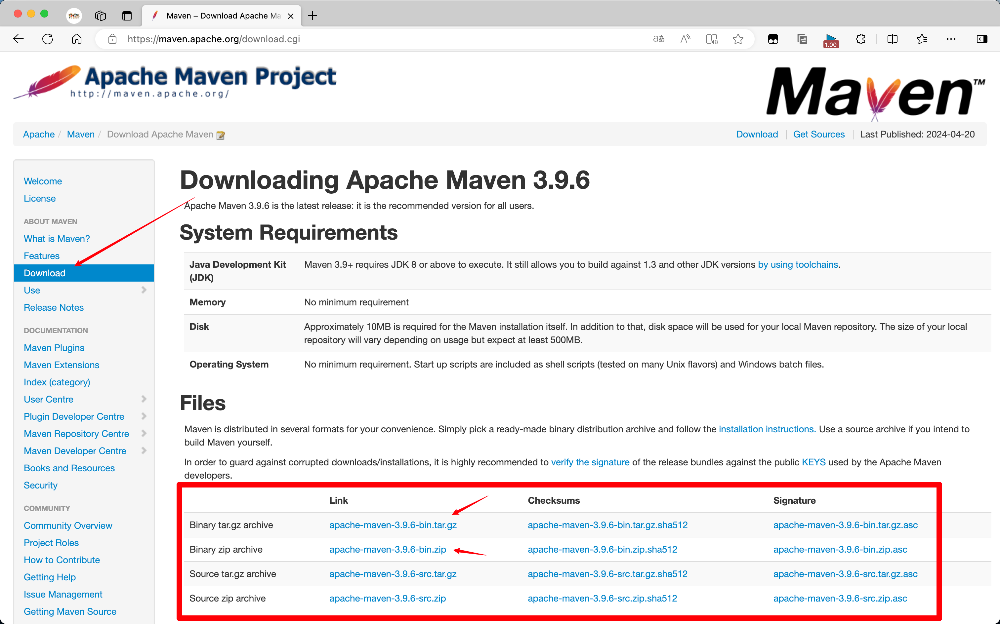

# Maven - 介绍、安装、配置

::: tip 开始之前

当正式开始学习本部分内容之前，其实大多数人都已经使用过 Maven 了，有人会说，我明明就是没有使用过 Maven ，也不会使用 Maven 才来学习这个，我要是用过还需要学吗？

答案是肯定的，举个简单的例子，当你在使用 IDEA 创建一个 SpringBoot 项目时，就已经默认配置好了 Maven，我们并没有去 SpringBoot 官网去下载所需要的 Jar 包，这都是 Maven 帮我们做好了。

那么又出现一个问题，你说我使用过 Maven，我都没有下载 Maven，也没有配置，怎么就直接使用了？

很简单，这种情况下你大概率使用的 IDEA 编译器，其本身就自带了 Maven，故你不用手动下载配置，直接可以使用。
:::


## Maven 介绍


### Maven 是什么？

> Apache Maven is a software project management and comprehension tool. Based on the concept of a project object model (POM), Maven can manage a project's build, reporting and documentation from a central piece of information.

Apache Maven 是一个软件项目管理和理解工具，基于项目对象模型（Project Object Model 即 POM）的概念，Maven 可以从中央信息中管理项目的构建、报告和文档。

Maven 是纯 Java 开发的开源项目，是一个对 Java 的项目管理工具，可以对 Java 项目进行构建、依赖管理。

Maven 也可被用于构建和管理各种项目，例如 C#，Ruby，Scala 和其他语言编写的项目。Maven 曾是 Jakarta 项目的子项目，现为由 Apache 软件基金会主持的独立 Apache 项目。


### 为什么要使用 Maven？

1. Maven 是一个依赖管理工具

在实际开发过程中，我们会使用到各种框架，或者框架封装的程度越来越高，项目中使用的 Jar 包也越来越多，Jar 包之间的依赖关系也非常复杂，手动获取 Jar 包的难度也非常大，这是因为各个厂商的 Jar 包下载地址各不相同，下载方式也不同，使用难度较大，使用 Maven 后，Maven 会帮助我们解决这些问题。

- Jar包规模：有时候项目使用的 jar 包很多，仅使用 SpringBoot、SpringCloud 的部分功能时，就达到了上百个 Jar 包，而使用 Maven 仅需几个核心配置项，简单方便。

- Jar包来源：建立统一的中央仓库，收录绝大部分常用 Jar 包，也可以上传自定义 Jar 包，大大提高了寻找 Jar 包的效率。
- Jar包关系：Jar 包之间也有复杂的依赖关系，有时可能同时同时依赖一个 Jar 包的不同版本，产生冲突，Maven 会帮我们处理这些关系。
- Jar包导入：Java Web 项目中 Jar 包必须存放在指定位置，管理较为分散，使用 Maven 后，直接在 Pom 文件统一配置即可。

2. Maven 是一个构建工具

在项目启动时，Maven 不是必须使用的，但构建是必须要做的，使用 IDEA 开发是时，构建是 IDEA 帮我们做的。

::: info target
打开 IDEA 中的排除文件显示，在项目运行后就可以看到创建了 target 文件夹，里面是构建好的 Java 字节码文件。
:::

脱离 IDE 环境时也需要构建


## Maven 安装
::: warning 
在前面我们说 IDEA 中已经自带了 Maven，为什么我们还要自己装呢？当然你可以不装，则默认使用 IDEA 中自带的，但是没有配置时，也仅能在 IDEA 中集成使用，且版本一般都不是最新版。如果不使用 IDEA 那么就需要手动装，所以安装这个小结还是很有必要的。
:::

任何操作系统均可去官网下载安装，这是最可靠的方式，但是由于 Maven 在国外，下载较慢，故提供以下方式下载。

- 官网下载安装



官网地址：https://maven.apache.org/download.cgi

### Windows

暂无其他下载方式

### MacOS

- Homebrew 安装

```sh
brew install maven
```

::: tip Homebrew 下载安装
使用该指令下载安装之前，请先确保成功安装的 Homebrew ，否则你将无法使用该命令安装。

- Homebrew 教程：https://www.codermast.com/dev-tools/homebrew.html
:::

### Linux

- 使用自带的依赖管理工具安装

```sh
# Ubuntu 系统
apt install maven
# Centos 系统
yum install maven
```

## Maven 配置

### 配置环境变量
::: tip 
不进可以配置下载好的 Maven ，也可以直接配置 IDEA 自带 Maven 的环境变量，找到对应的目录即可。
:::

#### Windows

::: warning 
博主暂无 Windows 操作系统，故无法演示。
:::

暂时参考该文：https://blog.csdn.net/inexaustible/article/details/127219595

#### MacOS

1. 检查 JDK 是否配置成功

```sh
java -version
```

2. 编辑当前用户的环境变量配置文件

```sh
vim ~/.bash_profile
```

3. 配置 Maven 环境变量

```sh
# 复制如下内容，MAVEN_HOME 替换为自己目录
export MAVEN_HOME=/Users/codermast/Documents/DevEnv/apache-maven-3.9.6
export PATH=$MAVEN_HOME/bin:$PATH:.
```

4. 使配置文件生效

```sh
source .bash_profile
```

5. 检查是否配置成功

```sh
# 配置成功后可在任意目录执行
mvn -v
```

成功返回 Maven 版本信息即可。

#### Linux

基本步骤和配置与 MacOS 类似。

1. 编辑环境变量配置文件

```sh
vim /etc/profile
```

2. 配置环境变量

```sh
# 复制如下内容，MAVEN_HOME 替换为自己目录
export MAVEN_HOME=/usr/local/maven/apache-maven-3.9.6
export PATH=$MAVEN_HOME/bin:$PATH
```

3. 使配置文件生效
```sh
source /etc/profile
```

4. 检查是否配置成功

```sh
# 配置成功后可在任意目录执行
mvn -v
```

### 配置自定义镜像

- 配置阿里云镜像

向下载解压后 `apache-maven-3.9.6/conf/setting.xml` 文件中的 `<mirrors></mirrors>` 标签内添加如下信息即可。

```xml
<!-- 阿里云仓库 -->
<mirror>
    <id>alimaven</id>
    <mirrorOf>central</mirrorOf>
    <name>aliyun maven</name>
    <url>http://maven.aliyun.com/nexus/content/repositories/central/</url>
</mirror>
```

::: tip 阿里云Maven
https://developer.aliyun.com/mirror/maven
:::