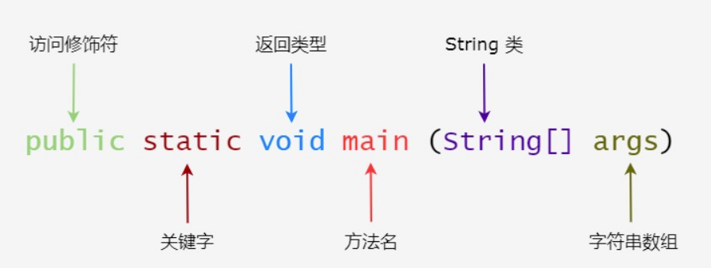

# Java基础 - 2.基本概念

::: tip 学习之前
在正式学习Java之前，我们首先需要了解一些基本的概念，如类和对象，局部变量和全局变量也叫属性，还有一些方法。
:::

## ❤️类
>类是一个模板，它描述一类对象的行为和状态。

&emsp;&emsp;举个我们生活中的例子，如：汽车，其实就只是一个模板而已，具体的汽车类型可以进行详细的分类，轿车、越野车、货车等等具体的实现，而汽车只是说明主要包含了那些，但是并没有将其实现。
&emsp;&emsp;又如动物，具体以后就是猫、狗、鸡、鸭等具体的动物，这里的动物就可以看做一个类。

## 💛对象
> 对象是类的一个实例，有状态和行为。

&emsp;&emsp;对象就是类的实例化，如一条狗就是一个动物的实例化对象。对象拥有一些属性，这些值来决定对象的状态。如狗的大小，体重，长度都可以来决定这个狗的一些状态。

## 💚属性
> 每个对象都有独特的属性变量，对象的状态由这些实例变量的值决定。


## 💙标识符
Java的所有组成部分，都需要有名称。如类需要类名，方法需要方法名，变量需要变量名，这些部分需要遵守一下命名规则：
1. 不能使用纯数字进行命名。
2. 必须以英文字母或者`$`或`_`开头。
3. 首字母以后可以使用英文字母或`$`、`_`和数字的任意组合。
4. Java中的所有关键字不能作为标识符。
5. 标识符是区分大小写的。
## 💜修饰符
Java可以使用修饰符来修饰类中方法和属性。主要有两类修饰符：

- 访问控制修饰符 : `default`, `public` , `protected`, `private`
- 非访问控制修饰符 : `final`, `abstract`, `static`, `synchronized`


## 🤎变量
Java中变量分为三种类型：
- 类属性（静态使用static关键字，通过类或者对象引用都可以调用）
- 对象属性（非静态，只能通过对象引用来调用）
- 局部变量
> 变量的生命周期为：从定义开始到当前范围内的下一个`}`结束
## 🖤数组
数组是储存在堆上的对象，可以保存多个同类型变量。数组内相邻的两个元素在内存中的地址也是相邻的。
> 如：int[] arr = new int[2];即定义一个大小为2的整型数组。

## 🤍枚举
枚举限制变量只能是预先设定好的值。使用枚举可以减少代码中的 bug。
> 如在选择性别时，只能有两个值，这时通常可以使用枚举。
## 💔关键字
关键字是Java程序内置的一些有特殊含义的关键字。
> 注意：Java 的 null 不是关键字，类似于 true 和 false，它是一个字面常量，不允许作为标识符使用。

| **关键字**   | **含义**                                                     |
| ------------ | ------------------------------------------------------------ |
| abstract     | 表明类或者成员方法具有抽象属性                               |
| assert       | 断言，用来进行程序调试                                       |
| boolean      | 基本数据类型之一，声明布尔类型的关键字                       |
| break        | 提前跳出一个块                                               |
| byte         | 基本数据类型之一，字节类型                                   |
| case         | 用在switch语句之中，表示其中的一个分支                       |
| catch        | 用在异常处理中，用来捕捉异常                                 |
| char         | 基本数据类型之一，字符类型                                   |
| class        | 声明一个类                                                   |
| const        | 保留关键字，没有具体含义                                     |
| continue     | 回到一个块的开始处                                           |
| default      | 默认，例如，用在switch语句中，表明一个默认的分支。Java8 中也作用于声明接口函数的默认实现 |
| do           | 用在do-while循环结构中                                       |
| double       | 基本数据类型之一，双精度浮点数类型                           |
| else         | 用在条件语句中，表明当条件不成立时的分支                     |
| enum         | 枚举                                                         |
| extends      | 表明一个类型是另一个类型的子类型。对于类，可以是另一个类或者抽象类；对于接口，可以是另一个接口 |
| final        | 用来说明最终属性，表明一个类不能派生出子类，或者成员方法不能被覆盖，或者成员域的值不能被改变，用来定义常量 |
| finally      | 用于处理异常情况，用来声明一个基本肯定会被执行到的语句块     |
| float        | 基本数据类型之一，单精度浮点数类型                           |
| for          | 一种循环结构的引导词                                         |
| goto         | 保留关键字，没有具体含义                                     |
| if           | 条件语句的引导词                                             |
| implements   | 表明一个类实现了给定的接口                                   |
| import       | 表明要访问指定的类或包                                       |
| instanceof   | 用来测试一个对象是否是指定类型的实例对象                     |
| int          | 基本数据类型之一，整数类型                                   |
| interface    | 接口                                                         |
| long         | 基本数据类型之一，长整数类型                                 |
| native       | 用来声明一个方法是由与计算机相关的语言（如C/C++/FORTRAN语言）实现的 |
| new          | 用来创建新实例对象                                           |
| package      | 包                                                           |
| private      | 一种访问控制方式：私用模式                                   |
| protected    | 一种访问控制方式：保护模式                                   |
| public       | 一种访问控制方式：共用模式                                   |
| return       | 从成员方法中返回数据                                         |
| short        | 基本数据类型之一,短整数类型                                  |
| static       | 表明具有静态属性                                             |
| strictfp     | 用来声明FP_strict（单精度或双精度浮点数）表达式遵循IEEE 754算术规范 |
| super        | 表明当前对象的父类型的引用或者父类型的构造方法               |
| switch       | 分支语句结构的引导词                                         |
| synchronized | 表明一段代码需要同步执行                                     |
| this         | 指向当前实例对象的引用                                       |
| throw        | 抛出一个异常                                                 |
| throws       | 声明在当前定义的成员方法中所有需要抛出的异常                 |
| transient    | 声明不用序列化的成员域                                       |
| try          | 尝试一个可能抛出异常的程序块                                 |
| void         | 声明当前成员方法没有返回值                                   |
| volatile     | 表明两个或者多个变量必须同步地发生变化                       |
| while        | 用在循环结构中                                               |

## ❤️‍🔥注释
和其他编程语言一样，Java中也可包含程序注释。在编译阶段，注释会被编译器忽视。
```java
public class HelloWorld {
   /* 这是第一个Java程序
    * 它将输出 Hello World
    * 这是一个多行注释的示例
    */
    public static void main(String[] args){
       // 这是单行注释的示例
       /* 这个也是单行注释的示例 */
       System.out.println("Hello World"); 
    }
}
```
## 💗方法
编写 Java 程序时，应注意以下几点：

1. 大小写敏感：Java 是大小写敏感的，这就意味着标识符 Hello 与 hello 是不同的。
2. 类名：对于所有的类来说，类名的首字母应该大写。如果类名由若干单词组成，那么每个单词的首字母应该大写，例如 MyFirstJavaClass 。
3. 方法名：所有的方法名都应该以小写字母开头。如果方法名含有若干单词，则后面的每个单词首字母大写。
4. 源文件名：源文件名必须和类名相同。当保存文件的时候，你应该使用类名作为文件名保存（切记 Java 是大小写敏感的），文件名的后缀为 .java。（如果文件名和类名不相同则会导致编译错误）。
5. 主方法入口：所有的 Java 程序由 public static void main(String[] args) 方法开始执行。

### ❣️概念
&emsp;&emsp;在Java程序中，大部分功能的实现是基于方法进行实现的，方法必须经过调用才能执行，一般情况下程序起始的方法名为main。
- 代码实现
```java
public class Main{
	public static void main(String[] args){
		System.out.println("Hello World!");
	}
}
```
### 💖组成部分
> 在Java中，方法是由以下几部分组成而来的。
- 访问修饰符：`public`、`protect`、`private`、`default`(默认也可以省略不写)
- 关键词
- 返回值类型
- 方法名称
- 参数列表
- 方法体：即实现方法功能的语句。


