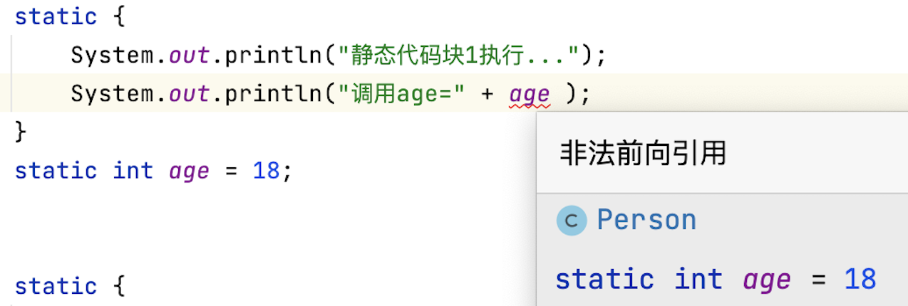

# Static关键字的五种用法详解

Static的五种用法大致如下：

- 修饰成员变量，使其成为类变量，也叫静态变量
- 修饰成员方法，使其成为类方法
- 修饰内部类，使其成为静态内部类
- 静态代码块
- 静态导包

> 直接一点将，static关键字就是把属性和方法变为类相关，而不是实例相关。

## 修饰成员变量

被static关键字修饰的属性叫做静态属性，也叫类属性。顾名思义现在该属性为该类所有，而非该类实例化的对象所有，在类的加载阶段进行初始化。虽然使用类实例化的对象也能够调用该属性，但是该属性是属于类所有，所有该类的实例化对象和该类共享一个值，即操作的是同一个值。

```java
public class Person{
  	static int age;
  	static int high = 175;
    public static void main(String[] args){
        System.out.println(age);
        System.out.println(high);
    }
}

class PersonTest{
    public static void main(String[] args){
        System.out.println(Person.age);
    }
}
```

> 成员变量不给初始值的话，会进行默认初始化。

被static修饰的属性，可以认为是属于类的，只要类进行加载以后，便可以使用`类名.属性名`进行调用。

## 修饰成员方法

被static关键字修饰的方法叫做类方法，修饰后的方法可以直接使`类名.方法名`调用，减少了实例化对象进行调用的资源消耗。

简单的来说被static修饰的方法，可以认为是属于类的，只要类进行加载以后，则就可以进行使用。

```java
public class Person{
  	static int age;
  	static int high = 175;
  	public static void seeMessage(String msg){
      	System.out.println(msg);
    }
}

class PersonTest{
    public static void main(String[] args){
        Person.seeMessage("Hello Codermast!");
    }
}
```

> 这里需要注意的是一个静态方法是不能够直接调用同类下的非静态方法，而同类下的非静态方法则可以调用同类下的静态方法。

## 修饰内部类

被static修饰的内部类完全独立于其所在的外部类，不属于外部类的对象，可以认为两个类是完全没有关系的两个类。

- 静态内部类可以包含静态成员，也可以包含非静态成员，但是在非静态内部类中不可以声明静态成员。
- 静态类内部不可以访问外部类的实例成员，只能访问外部类的类成员，即使是静态内部类的实例方法也不能访问外部类的实例成员，只能访问外部类的静态成员
- 外部类不可以定义为静态类，Java中静态类只有一种，那就是静态内部类，顶级类不能用static 修饰

外部类如何调用静态内部类的属性和方法：

1. 外部类可以通过创建静态内部类实例的方法来调用静态内部类的非静态属性和方法
2. 外部类可以直接通过“ 外部类.内部类.属性（方法）” 的方式直接调用静态内部类中的静态属性和方法

创建一个静态内部类实例：

- 在外部类中：直接使用类名创建即可，`内部类名 name = new 内部类构造器;`
- 在其他类中：使用`外部类.内部类 name = new 外部类.内部构造器;`

## 静态代码块

static修饰代码块的作用就是，在类加载以后进行执行这段代码。我们需要着重看一下具体的执行顺序。下面是一个简单的示例。

```java
class Dog {
    String name;
    public Dog(String name) {
        this.name = name;
        System.out.println("狗的名字叫：" + name);
    }
}

class Person {
    String name;
    public Person(String name){
        this.name = name;
        System.out.println("人的名字叫：" + name);
    }

    static int age = 18;

    static {
        System.out.println("静态代码块1执行...");
    }

    static Dog xiaohuang = new Dog("小黄");

    Dog xiaohua = new Dog("小花");
    static {
        System.out.println("静态代码块2执行...");
    }

    static int high = 175;

    Dog xiaohei = new Dog("小黑");

    static Dog xiaobai = new Dog("小白");


    public static void main(String[] args) {
        Person person = new Person("codermast");
    }
}
```

该示例执行后的结果如下所示：

```shell
静态代码块1执行...
狗的名字叫：小黄
静态代码块2执行...
狗的名字叫：小白
狗的名字叫：小花
狗的名字叫：小黑
人的名字叫：codermast
```

则我们可以判断出执行的顺序为：

1. 静态代码块和静态属性的顺序执行
1. 非静态属性的执行
1. 方法的调用

> 这里主要解释第一点，静态代码块和静态属性属于同一优先级，顺序执行。举个简单的例子即可理解，这里我们就无法调用到age属性


 

## 静态导包

静态导包用法，将类的方法直接导入到当前类中，从而直接使用“方法名”即可调用类方法，更加方便。

- PrintMsg类

```java
public class PrintMsg{
  	public static void printMsg(String msg){
      	System.out.println(msg)
    }
}
```

- Test类

```java
import static codermast.util.PrintMsg.*;
public class Test{
  	public static void main(String[] args){
      	printMsg("hello codermast!")
    }
}
```

运行Test类中的main方法后，就能在控制台看到“hello codermast！”的一行输出。

> 需要注意的是：导入的静态方法所处的类，不能和调用的类在同一个包下。
