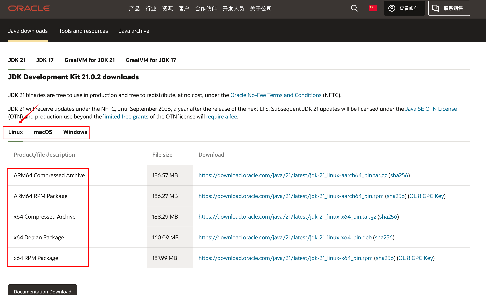

# Java - Java 开发环境配置

## 下载 JDK

1. 官网下载：https://www.oracle.com/cn/java/technologies/downloads/



选择适配自己电脑的版本，点击下载即可。

2. 使用 IDEA 中的集成配置

选择一个项目并打开，打开项目结构设置，选择 JDK 下载即可。


## 配置环境变量

### Windows

::: tip
博主使用的是 Macos 故无法演示 Windows 下的环境变量配置，请参考本篇文章：https://blog.csdn.net/qq_38436214/article/details/105071088
:::

### Macos

::: tip
参考本篇文章：https://blog.csdn.net/m0_51520179/article/details/131295356
:::


## 环境检测

在系统命令行中，任意位置处执行如下指令，均能获取到 Java 版本信息，说明配置成功。
```sh
java -version
```


