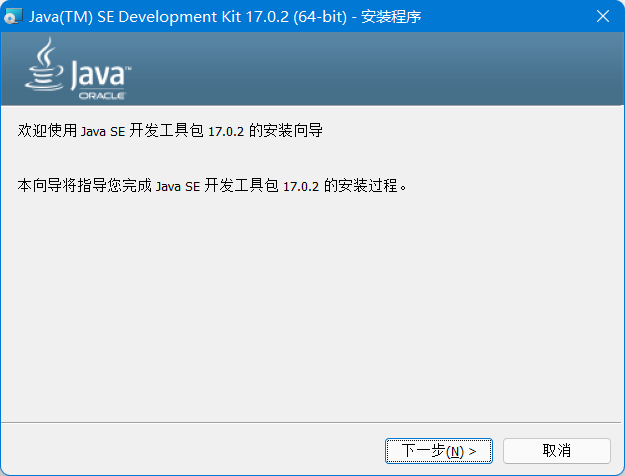

# Java - JDK下载与环境配置

## 下载 JDK

**1. 官网下载**

::: tip Oracle官网
https://www.oracle.com/cn/java/technologies/downloads/
:::

选择适配自己电脑的版本，点击下载即可。

1. 访问Oracle官网，找到该位置的Java


2. 点击此处的下载


3. 选择对应的版本下载


## 安装JDK

1. 打开下载好的安装包，点击下一步



2. 选择指定目录，点击下一步


3. 等待安装完成。


> 注意：java这个时候我们只是安装好了JDK，但是并没有设置其环境变量，所以我们是没有办法使用命令行运行javac程序的。必须配置环境变量才能使用。

2. 使用 IDEA 中的集成配置

选择一个项目并打开，打开项目结构设置，选择 JDK 下载即可。


## 配置环境变量

### Windows

1. 在电脑搜索栏搜索**编辑环境变量**


2. 选择环境变量


3. 选择系统变量中的PATH这一行，点击编辑


4. 点击新建


5. 输入刚才JDK的安装路径，直到bin目录为止


6. 点击确定，这个时候就已经配置成功了。


### Macos

::: tip
参考本篇文章：https://blog.csdn.net/m0_51520179/article/details/131295356
:::


## 环境检测

在系统命令行中，任意位置处执行如下指令，均能获取到 Java 版本信息，说明配置成功。
```sh
java -version
```


::: warning 注意
在确保自己都是正确操作的情况下，仍无法正确执行，此时重启一下电脑，使配置项生效即可。
:::