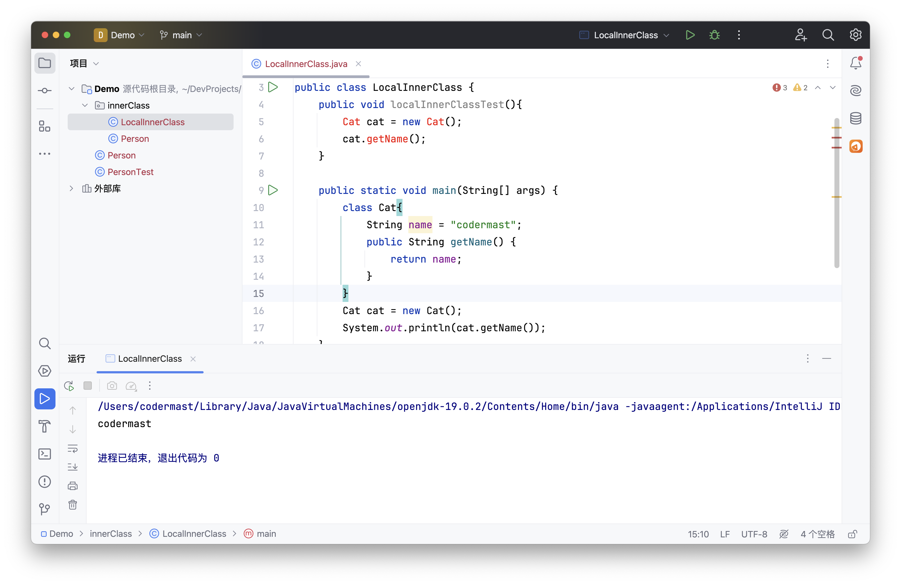

# Java核心 - 面向对象

面向对象（Object-Oriented，OOP）是一种程序设计的编程范式，主要基于对象这个概念，将相关的数据和方法组织成一个整体看待，本质上是模拟现实中解决问题的过程。

## 面向对象三个特性

面向对象的三大基本特征是：封装、继承、多态

### 封装


封装是将对象的属性和方法封装在一个类的内部，对外部隐藏对象的具体实现细节。通过封装，对象的内部实现对外部是不可见的，只有公共接口对外部可见。仅能通过提供的公共接口来操作改对象。

最常用的就是使用 `private` 关键字修饰，将一些数据进行隐藏，仅对外提供一些公共操作方法，让外部程序通过该类提供的方法来实现对内部信息的操作和访问。

::: tip 优点：安全性高、复用性强
安全性：通过方法来控制成员变量的操作，提高了代码的安全性
复用性：把代码用方法进行封装，提高了代码的复用性​，降低了耦合性。
:::

### 继承

继承是指一个类通过继承从另外一个类中获取其属性和方法，子类可以继承父类的属性、重写父类的方法，从而减少代码量。这使得这两个类从逻辑上来说是父子关系，此时子类具有所有父类的属性和方法，同时也可以对这些属性和方法进行修改，以满足自身的需求。

- 优点：提高代码复用性，维护性，实现代码共享。
- 缺点：代码的耦合性较高，父类做出修改时，其所有子类都会受到影响。
- 特点：子类可以拥有自身独有的属性和方法，即子类可对父类进行扩展，也可以自己实现父类的方法。
- 注意：Java不支持多继承，但是支持多重继承，可以对接口的多实现。

::: info 多继承、多重继承、多实现
- 多继承：一个类一次性继承多个类。
- 多重继承：一个类在继承另外一个类后，仍可被其他类继承。
- 多实现：一个类可以一次性实现多个接口。
:::

子类的所有构造方法会默认先运行 `super()` ，即调用父类对应参数的构造方法。

### 多态

多态是指同一行为具有多个不同的表现形式或者形态。例如同一个接口被不同的类实现，他们的实现方式不一定相同，所执行的过程也就会不相同。

多态允许不同的对象对同一消息做出响应，提供了灵活性和可扩展性。多态的实现方式包括方法重载和方法重写。

多态最常用的就是接口引用指向实现类对象，这样当之后程序需要更新时，仅需更新实现类，而表现类型不必更改，故不会影响到后面程序的执行。大大降低了程序的耦合度。

**向上转型**：父类的引用指向了子类对象。编译看左边（调用子类特有属性或方法，编译不通过），运行看右边（运行时，优先调用子类方法）。

```java
Animal cat = new Cat();
```

在这个例子中，Animal 类型的引用 cat 指向了 Cat 类型的对象。编译过程中，如果发现通过该引用调用 Cat 类型对象的特有属性或方法，则会报错，在执行过程中，如果子类重写了父类方法，优先执行重写后的方法。没有重写，则执行父类对应方法。

**向下转型**：子类引用指向父类对象。编译看右边，运行看右边。

```java
Animal animal = new Cat();  // 向上转型：子类->父类
animal.eat();               // 调用的是子类的方法

Cat cat = (Cat)animal;      // 向下转型：父类->子类
cat.work();                 // 调用的是子类的方法
```

## 类和对象

### 概述

- 类：类是对象的模板，它定义了对象的属性和方法。类是对象的抽象，实际的对象是根据类的定义实例化而来的。
- 对象：对象是类的实例，在程序中被抽象为具有属性和方法的实例。每个对象的属性和方法各自独立，互不影响。

**类是对象的抽象，对象是类的具体化。**

举个简单的例子，Person 可以看做一个类，而小明、小红、小张就是三个该类的对象。

```java
class Person{
    String name;
    int age;

    public Person(String name,int age){
        this.name = name;
        this.age = age;
    }

    public void eat(){
        System.out.println(name + "在吃饭...");
    }

    public void getAge(){
        System.out.println(name + "今年" + age + "岁了...");
    }
}
```

```java
public class PersonTest {
    public static void main(String[] args) {
        // 创建 Person 类的对象
        Person person1 = new Person("小明", 18);
        Person person2 = new Person("小红", 19);
        Person person3 = new Person("小张", 20);
 
        person1.eat();
        person2.eat();
        person3.eat();

        person1.age();
        person2.age();
        person3.age();
    }
}
```


### 内部类

在 Java 中可以将一个类定义在另外一个类里面或者方法里面，这样的类就成为内部类。常见的内部类有：成员内部类、局部内部类、静态内部类、匿名内部类。

1. 成员内部类

成员内部类是指，在类中嵌套的一种类，它具有访问外部类成员的权限，但由于其被嵌套在外部类中，必须先实例化外部类，才能通过外部类对象实例化内部类。

内部内是可以访问外部类的成员变量的。

```java
class Person {
    String name = "animal";
    
    class Cat{
        int age = 3;

        public int getAge() {
            return age;
        }
        
        public String getName(){
            return name;
        }
    }

    public static void main(String[] args) {
        Person person = new Person();

        Person.Cat cat = person.new Cat();
        System.out.println(cat.getAge());
        System.out.println(cat.getName());
    }
}
```

执行结果为：
```
3
animal
```

::: warning 私有内部类
如果不希望内部类被外部类访问，可以使用 `private` 或者 `protected` 关键字修饰，此时无法通过上述方式创建。
:::

2. 局部内部类

局部内部类是指定义在方法中或者作用域内的类，仅能在该作用域内生效。

```java
public class LocalInnerClass {
    public void localInnerClassTest(){
        Cat cat = new Cat();
        cat.getName();
    }

    public static void main(String[] args) {
        class Cat{
            String name = "codermast";
            public String getName() {
                return name;
            }
        }
        Cat cat = new Cat();
        System.out.println(cat.getName());
    }
}
```



局部内部类类似于方法中的局部变量，不能有 `public`、`private`、`protected`以及 `static` 修饰。

3. 静态内部类

静态内部类可以使用 static 关键字定义，静态内部类我们不需要创建外部类来访问，可以直接访问。

```java
public class StaticInnerClass {
    static class Dog{
        String name = "codermast";

        public String getName() {
            return name;
        }
    }

    public static void main(String[] args) {
        Dog dog = new Dog();

        System.out.println(dog.getName());
    }
}
```


::: warning 注意
静态内部类无法访问外部类的成员，只能访问外部类的静态属性。静态类本质上和静态方法类似，外部类的成员是属于对象的，而不是属于类的。
:::

4. 匿名内部类

匿名内部类是唯一一种没有构造器的类。正因为其没有构造器，所以匿名内部类的使用范围非常有限，大部分匿名内部类用于接口回调。匿名内部类在编译的时候由系统自动起名为 `Outter$1.class`。

一般来说，匿名内部类用于继承其他类或是实现接口，并不需要增加额外的方法，只是对继承方法的实现或是重写。

```java
public class AnonymousInnerClass {

    private Runnable runnable = new Runnable() {
        @Override
        public void run() {
            System.out.println("running...");
        }
    };

    public static void main(String[] args) {
        AnonymousInnerClass anonymousInnerClass = new AnonymousInnerClass();
        anonymousInnerClass.runnable.run();
    }
}
```


::: warning 注意
Java 中禁止在匿名内部类中修改外部局部变量，是因为Java对于匿名内部类传递变量的实现是基于构造器传参的，也就是说如果允许你在匿名内部类中修改值，你修改的是匿名内部类中的外部局部变量副本，最终并不会对外部类产生效果。
:::

### 创建对象

常用的创建对象有这几种方式：new、反射、clone()方法、反序列化。

- 使用 new 关键字创建：最常见的创建方式

```java
Person person = new Person();
```

- 反射创建：通过反射机制，可以在运行时获取类的信息，动态创建对象。

```java
Class<?> clazz = Person.class;
Person person = (Person) clazz.newInstance();
```
::: warning 注意
在 JDK1.9之后 ~~newInstance()~~ 方法已经弃用，该方法调用无参构造器，若是没有，则会报异常。

可以使用 `class.getDeclaredConstructor().newInstance()`来调用。

该方法会根据他的参数对该类的构造函数进行搜索并返回对应的构造函数，没有参数就返回该类的无参构造函数，然后再通过 `newInstance` 进行实例化。
:::


- 对象的clone()方法创建

要实现克隆，类必须实现 Cloneable 接口，并重写 clone() 方法。这种方式可以实现对象的浅拷贝或深拷贝。

```java
public class Person implements Cloneable{
    String name = "codermast";

    @Override
    public Person clone() throws CloneNotSupportedException {
        return (Person) super.clone();
    }

    public static void main(String[] args) throws CloneNotSupportedException {
        Person person = new Person();

        Person clone = person.clone();

        System.out.println("new 创建的 Person 对象 name = " + person.name);
        System.out.println("clone 创建的 Person 对象 name = " + clone.name);
    }
}
```

执行结果：

```
new 创建的 Person 对象 name = codermast
clone 创建的 Person 对象 name = codermast
```

- 反序列化创建

通过反序列化，可以将对象的状态从持久性存储中重新创建出来。需要让类实现 `Serializable` 接口，并使用 `ObjectInputStream` 类的 `readObject()`方法从文件或网络中反序列化对象。

```java
// 反序列化对象
try (ObjectInputStream ois = new ObjectInputStream(new FileInputStream("person.ser"))) {
    Person person4 = (Person) ois.readObject();
} catch (IOException | ClassNotFoundException e) {
    e.printStackTrace();
}
```

## 属性

属性又称为字段或成员变量，是类中存储数据的变量。可以是基本数据类型，也可以是引用数据类型。分为类属性和对象属性。

- 类属性，是指其属于类，可以直接通过类名调用，也可以由对象引用调用，整个类共有，仅维护一份，类加载时初始化。需使用 `static` 关键字修饰。
- 对象属性，是指其属于对象，需要通过实例化对象的引用来调用，对象私有，每个对象内都维护一份，对象构建时初始化。

## 方法

方法是对一段代码能够实现特定功能代码的封装。定义一次，可以被多次调用。分为类方法和对象方法。方法的定义包括以下几个要素：

- 访问修饰符：方法可以有访问修饰符，例如 `public`、`private`、`protected` 或默认（包内可见）。
- 返回值类型：方法可以返回一个值，指定返回值的数据类型，不返回是使用 `void`。
- 方法名：方法名是方法的标识符，用于在程序中调用方法。
- 参数列表：方法可以接受零个或多个参数，参数用于向方法传递数据。
- 方法体：方法体包含实际执行的代码块，实现方法的功能。

方法的定义语法如下：

```java
访问修饰符 关键字 返回值类型 方法名称 (参数列表){
    // 方法内要执行的语句
    return 返回值;
}
```

### 方法的分类

- 按功能来分：构造方法、非构造方法。

除了构造方法以外的方法，都是非构造方法。

构造方法是指，没有返回值，且方法名和类名相同的方法。

- 按归属来分：静态方法、对象方法。

静态方法是属于类的方法，需要使用 `static` 关键字修饰。
对象方法是属于对象的方法，没有使用 `static` 关键字修饰。

### 方法的调用

方法调用是程序执行的一个重要步骤，它使代码更具可重用性。

1. 同类中调用：可以直接使用方法名进行调用。

```java
int result = add(5, 3);
```

2. 其他类调用：比如指定是哪个类或者哪个对象的方法。

```java
int result = Math.max(5, 3);
```

3. 类方法调用：即静态方法的调用，直接通过类名调用。

```java
int result = Math.max(5, 3);
```

4. 对象方法调用：需要先构建拥有该方法的对象，然后通过该对象调用。

```java
Person person = new Person();

person.seeHello();
```

### 方法的重载和重写

方法的重载是指一个类中可以有多个方法具有相同的方法名，但这些方法的参数类型不同、个数不同、顺序不同。

方法的重写是指在子类中可以有和父类方法名、参数列表完全相同的方法，在执行时优先调用。

::: tip 重载和重写的区别？

- 方法的重载和重写都是实现多态的方式，区别在于前者实现的是编译时的多态性，而后者实现的是运行时的多态性。
- 重载发生在一个类中，同名的方法如果有不同的参数列表（参数类型不同、参数个数不同或者二者都不同）则视为重载；重写发生在子类与父类之间，重写要求子类被重写方法与父类被重写方法有相同的参数列表，有兼容的返回类型，比父类被重写方法更好访问，不能比父类被重写方法声明更多的异常（里氏代换原则）。
- 重载与访问修饰符无关，重写不能比父类更严格。
- 重载对返回类型没有特殊的要求，不能根据返回类型进行区分。
- 构造方法可以重载，但是不能重写。
:::

### 可变参数

Java 5 以后引入了可变参数（Varargs），允许方法接受可变数量的参数。可变参数在方法的参数列表中使用省略号 ... 表示。

```java
public void getName(String ... names){
    for (String name : names) {
        System.out.println(name);
    }
}
```

::: warning 注意
- 可变参数必须是方法的最后一个参数。例如void (int a,int... b)正确，而void (int... a,int b)会报错。
- 一个方法最多只能有一个可变参数。
- 可变参数在方法内部被当作数组处理。
:::

### 构造方法

构造方法是一种特殊的方法，与类同名，没有返回类型。每次创建对象时，都会默认执行一次构造方法。

**特点：**

- 与类同名，没有返回类型；
- 构造方法在对象创建时执行，用于设置对象的初始状态。 
- 每个类都可以有一个或多个构造方法，但通常至少有一个默认构造方法（无参数）。
- 默认构造方法：如果在类中没有明确定义任何构造方法，Java 会自动为该类提供一个默认的无参数构造方法。这个默认构造方法执行时不进行特定的初始化操作。
- 重载：和普通方法一样，构造方法也支持重载，即在同一个类中可以定义多个同名但参数列表不同的构造方法。

## 接口和抽象类


- 接口：对行为的抽象，如从唱、跳、Rap、篮球等行为中抽象出运动这种行为。接口使用 `interface` 关键字修饰。
- 抽象类：对类的抽象，如从猫、狗、猪等类中抽象出动物类。抽象类使用 `abstract` 关键字修饰。

### 接口

- 接口使用 `interface` 关键字修饰。
- 接口没有构造方法。
- 接口中的方法会被隐式的指定为 `public abstract` 方法，不能定义静态方法。
- 接口中的变量会被隐式的指定为 `public static final` 变量，不能定义私有成员。因为是final所以也要显式赋初值。
- 接口可以同时继承多个接口，类可以一次性实现多个接口。
- 接口的实现类：除非实现接口的类是抽象类，否则该类要定义接口中的所有方法。
- 接口的新特性：默认方法和静态方法。
    - 默认方法（`default method`）
        - 必须使用 defult 关键字修饰；
        - 定义了 default 的方法可以不被实现子类所实现，但只能被实现子类的对象调用；
        - 如果子类实现了多个接口，并且这些接口包含一样的默认方法，则子类必须重写默认方法；
    - 静态方法（`static method`）
        - 允许使用 static 关键字修饰一个方法，并提供实现，称为接口静态方法。
        - 接口静态方法只能通过接口调用（接口名.静态方法名）。
### 抽象类

抽象类可以包含抽象方法、具体方法、字段和构造方法。

**使用场景：**

建模共性行为：当多个类具有相同的行为，可以将这些行为提取到一个抽象类中，以便实现代码的重用。
规范子类：抽象类可以用于规定子类应该实现的一组方法，强制子类提供这些方法的实现。

**主要特征：**

- 抽象类不能被实例化只能被继承；
- 包含抽象方法的一定是抽象类，但是抽象类不一定含有抽象方法；
- 抽象类中的抽象方法的修饰符只能为public或者protected，默认为public；
- 一个子类继承一个抽象类，则子类必须实现父类抽象方法，否则子类也必须定义为抽象类；
- 抽象类可以包含属性、方法、构造方法，但是构造方法不能用于实例化，主要用途是被子类调用。

### 接口和抽象类的区别

**相同点**

1. 接口和抽象类都不能被实例化。
2. 接口和抽象类都可以有抽象方法，实现接口或继承抽象类的普通子类都必须实现这些抽象方法

**不同点**

1. 接口只有定义，不能有方法的实现，java 1.8中可以定义default方法体，而抽象类可以有定义与实现，方法可在抽象类中实现。
2. 实现接口的关键字为implements，继承抽象类的关键字为extends。一个类可以实现多个接口，但一个类只能继承一个抽象类。所以，使用接口可以间接地实现多重继承。
3. 接口强调特定功能的实现，而抽象类强调所属关系。
4. 接口只能定义静态常量（static final）；其所有的成员方法都是public、abstract的。抽象类中成员变量默认default，可在子类中被重新定义，也可被重新赋值；抽象方法被abstract修饰，不能被private、static、synchronized和native等修饰，必须以分号结尾，不能指定具体的实现过程。
5. 接口里没有构造器，而抽象类可以包含构造器，但构造器并不是让其用来构造对象的，是提供给其子类调用这些构造器来完成初始化的。
6. 接口里不能包含初始化块,抽象类则可以包含初始化块（静态代码块和实例代码块）