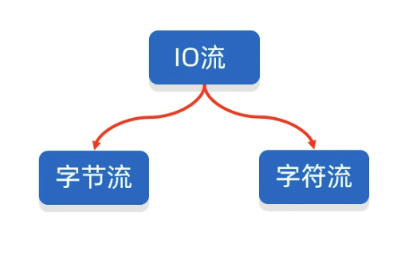

# Java IO - IO流概述

::: warning 为什么学习了 File 还要学习 IO 流呢？
在上一节「[Java IO - File 类](/java/io/file.html)」中，我们了解了 File 类的常用 API，以及演示了如何去使用这些 API，但是 File 对象只能表示系统中的文件或者文件夹的路径，只能对文件本身进行操作，不能对里面的内容进行操作。

这听起来似乎很矛盾，只能对文件本身进行操作，为什么又不能对里面的内容进行操作呢？

这里的意思是指，你只能对该文件的一些基本属性进行操作，例如文件名、文件大小、文件格式等等，而不能对文件的内容进行操作。想要对文件内容进行更改，就得通过 IO 流来进行。
:::

## 什么是 IO 流？

IO 流，即输入/输出流（Input/Output Stream），是计算机程序中用于处理输入和输出操作的抽象概念。在 Java 编程语言中，IO 流提供了一种灵活且强大的方式来读取和写入数据。

这些流可以代表多种不同类型的数据源和目标，例如文件、网络连接、内存缓冲区等。通过IO流，Java 程序可以读取或写入数据，实现与外部系统的通信和数据交换。

在 Java 中输入和输出是以程序为主体，程序从文件中读数据时为输入，程序向文件中写数据时为输出。

## IO流的分类

- 以流的方向分类：输入流、输出流

- 以操作的文件类型分类：字节流、字符流

字节流能处理任意格式的文件，而字符流只能处理纯文本文件。纯文本文件是指能够直接通过记事本打开的文本文件。

txt、md等格式的文件，是纯文本文件，而 word、xls 等格式的文件就不是纯文本文件。只有纯文本文件才能通过字符流处理。

::: warning 既然字节流能处理任何格式的文件，那么字符流还有存在的意义吗？
答案很显然，当然是有用的，字符流在处理的时候每次以字符大小为单位进行读取，在处理纯文本文件时，字符流的处理效率比字节流的效率高很多，故其存在是有意义的。
:::

## IO流体系