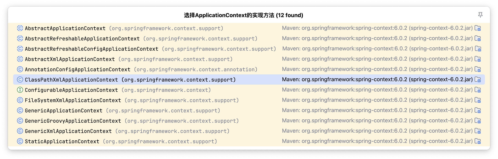

# Spring - IOC容器

IoC 是 Inversion of Control 的简写，译为“控制反转”，它不是一门技术，而是一种设计思想，是一个重要的面向对象编程法则，能够指导我们如何设计出松耦合、更优良的程序。

Spring 通过 IoC 容器来管理所有 Java 对象的实例化和初始化，控制对象与对象之间的依赖关系。

我们将由 IoC 容器管理的 Java 对象称为 Spring Bean，它与使用关键字 new 创建的 Java 对象没有任何区别。

IoC 容器是 Spring 框架中最重要的核心组件之一，它贯穿了 Spring 从诞生到成长的整个过程。

## IOC容器

### IOC控制反转

- 控制反转是一种思想。
- 控制反转是为了降低程序耦合度，提高程序扩展力。
- 控制反转，反转的是什么？

    - 将对象的创建权利交出去，交给第三方容器负责。
    - 将对象和对象之间关系的维护权交出去，交给第三方容器负责。
    > 举个简单的例子，如果我们要创建一个对象 A，而 A 又需要 B，那么我们在创建 A 的时候，就需要先创建一个 B，才能创建一个 A。通过 IOC，我们可以将 A、B 都交给 IOC 容器，此时再创建 A 时，IOC 容器会自动创建好 B 和 A。

> 通过 IOC 创建的对象和我们使用 new 创建的 Java 对象没有任何区别。

IOC 容器中放的是 Bean 对象，使用的是 Map 集合来进行存储。 

控制反转这种思想如何实现呢？DI（Dependency Injection）：依赖注入

### 依赖注入

DI（Dependency Injection）：依赖注入，依赖注入实现了控制反转的思想。

依赖注入：指Spring创建对象的过程中，将对象依赖属性通过配置进行注入

依赖注入常见的实现方式包括两种：

- 第一种：set方法注入
- 第二种：构造方法注入

本质上来说 IOC 就是一种控制反转的思想， 而 DI 是对IOC的一种具体实现。

**Bean管理说的是：Bean对象的创建，以及Bean对象中属性的赋值（或者叫做Bean对象之间关系的维护）。**

### IoC容器在Spring中的实现

Spring 的 IoC 容器就是 IoC思想的一个落地的产品实现。IoC容器中管理的组件也叫做 bean。在创建 bean 之前，首先需要创建IoC 容器。Spring 提供了IoC 容器的两种实现方式：

**①BeanFactory**

这是 IoC 容器的基本实现，是 Spring 内部使用的接口。面向 Spring 本身，不提供给开发人员使用。

**②ApplicationContext**

BeanFactory 的子接口，提供了更多高级特性。面向 Spring 的使用者，几乎所有场合都使用 ApplicationContext 而不是底层的 BeanFactory。

**③ApplicationContext的主要实现类**

| 类型名                          | 简介                                                         |
| ------------------------------- | ------------------------------------------------------------ |
| ClassPathXmlApplicationContext  | 通过读取类路径下的 XML 格式的配置文件创建 IOC 容器对象       |
| FileSystemXmlApplicationContext | 通过文件系统路径读取 XML 格式的配置文件创建 IOC 容器对象     |
| ConfigurableApplicationContext  | ApplicationContext 的子接口，包含一些扩展方法 refresh() 和 close() ，让 ApplicationContext 具有启动、关闭和刷新上下文的能力。 |
| WebApplicationContext           | 专门为 Web 应用准备，基于 Web 环境创建 IOC 容器对象，并将对象引入存入 ServletContext 域中。 |
