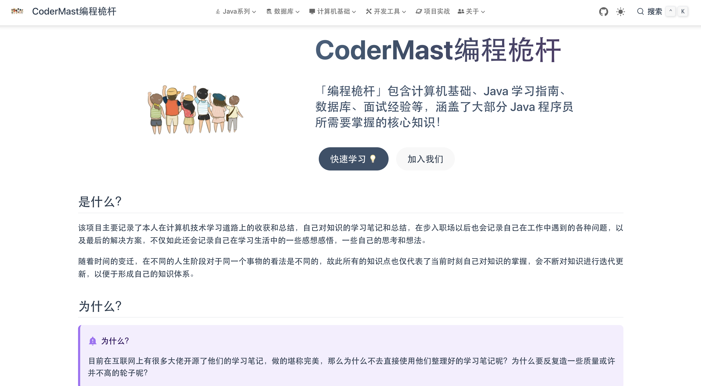

## 项目介绍

&emsp;&emsp;本项目是基于Vuepress框架 Vuepress-theme-hope主题搭建的一个个人学习笔记文档站点，项目内记录了本人学习过程中所总结的一些学习经验，其中包括Java、MySQL、Redis、Spring、SpringBoot、Kafka、Mybatis、Mybatis-plus、Docker、Linux、ElasticSearch、计算机网络、数据结构、操作系统、计算机组成原理等知识。

## 项目地址

<a href="https://www.codermast.com/?github">www.codermast.com</a>

## 项目内容

### Java
- Java基础
- Java集合
- JavaIO
- Java 8
- JVM

### MySQL

<!---->
    <ul class="vp-catalogs">
        <li class="vp-catalog">
            
<a class="route-link vp-catalog-title"
                    href="https://www.codermast.com/database/mysql/mysql-base.html">MySQL基础 - 基础概念</a>

        </li>
        <li class="vp-catalog">
            
<a class="route-link vp-catalog-title"
                    href="https://www.codermast.com/database/mysql/sql-general-syntax.html">MySQL基础 - SQL基础语法</a>

        </li>
        <li class="vp-catalog">
            
<a class="route-link vp-catalog-title"
                    href="https://www.codermast.com/database/mysql/function-base.html">MySQL基础 - 函数</a>

        </li>
        <li class="vp-catalog">
            
<a class="route-link vp-catalog-title"
                    href="https://www.codermast.com/database/mysql/constraint.html">MySQL基础 - 约束</a>

        </li>
        <li class="vp-catalog">
            
<a class="route-link vp-catalog-title"
                    href="https://www.codermast.com/database/mysql/multi-table-query.html">MySQL基础 - 多表查询</a>

        </li>
        <li class="vp-catalog">
            
<a class="route-link vp-catalog-title"
                    href="https://www.codermast.com/database/mysql/transaction.html">MySQL基础 - 事务</a>

        </li>
        <li class="vp-catalog">
            
<a class="route-link vp-catalog-title"
                    href="https://www.codermast.com/database/mysql/mysql-index.html">MySQL进阶 - 索引</a>

        </li>
        <li class="vp-catalog">
            
<a class="route-link vp-catalog-title"
                    href="https://www.codermast.com/database/mysql/sql-perfomance-analysis.html">MySQL进阶 - SQL性能分析</a>

        </li>
        <li class="vp-catalog">
            
<a class="route-link vp-catalog-title"
                    href="https://www.codermast.com/database/mysql/sql-optimize.html">MySQL进阶 - SQL优化</a>

        </li>
        <li class="vp-catalog">
            
<a class="route-link vp-catalog-title"
                    href="https://www.codermast.com/database/mysql/mysql-view.html">MySQL进阶 - 视图</a>

        </li>
        <li class="vp-catalog">
            
<a class="route-link vp-catalog-title"
                    href="https://www.codermast.com/database/mysql/store-procedure.html">MySQL进阶 - 存储过程</a>

        </li>
        <li class="vp-catalog">
            
<a class="route-link vp-catalog-title"
                    href="https://www.codermast.com/database/mysql/mysql-trigger.html">MySQL进阶 - 触发器</a>

        </li>
        <li class="vp-catalog">
            
<a class="route-link vp-catalog-title"
                    href="https://www.codermast.com/database/mysql/innodb-engine.html">MySQL进阶 - InnoDB存储引擎</a>

        </li>
        <li class="vp-catalog">
            
<a class="route-link vp-catalog-title"
                    href="https://www.codermast.com/database/mysql/mysql-lock.html">MySQL进阶 - 锁</a>

        </li>
        <li class="vp-catalog">
            
<a class="route-link vp-catalog-title"
                    href="https://www.codermast.com/database/mysql/innodb-mvcc.html">MySQL进阶 - MVCC多版本并发控制</a>

        </li>
        <li class="vp-catalog">
            
<a class="route-link vp-catalog-title"
                    href="https://www.codermast.com/database/mysql/storage-engine.html">MySQL进阶 - 存储引擎</a>

        </li>
        <li class="vp-catalog">
            
<a class="route-link vp-catalog-title"
                    href="https://www.codermast.com/database/mysql/mysql-manage.html">MySQL进阶 - MySQL管理</a>

        </li>
        <li class="vp-catalog">
            
<a class="route-link vp-catalog-title"
                    href="https://www.codermast.com/database/mysql/dividing-databases-tables.html">MySQL运维 - 分库分表</a>

        </li>
        <li class="vp-catalog">
            
<a class="route-link vp-catalog-title"
                    href="https://www.codermast.com/database/mysql/mysql-log.html">MySQL运维 - 日志</a>

        </li>
        <li class="vp-catalog">
            
<a class="route-link vp-catalog-title"
                    href="https://www.codermast.com/database/mysql/read-write-separation.html">MySQL运维 - 读写分离</a>

        </li>
        <li class="vp-catalog">
            
<a class="route-link vp-catalog-title"
                    href="https://www.codermast.com/database/mysql/master-slave-replication.html">MySQL运维 - 主从复制</a>

        </li>
    </ul>

## Star趋势
> 虽然项目的 Star 可能非常非常少，但也足以鼓励我继续坚持下去！

